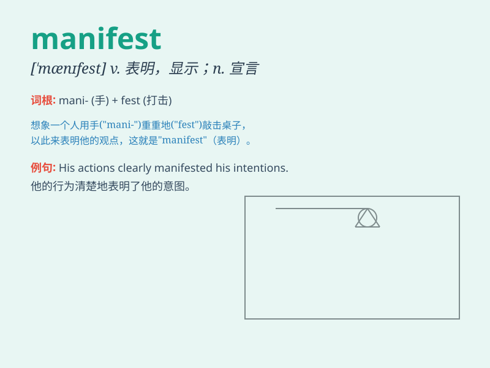

## manifest

**英音:** _[\'mænɪfest]_ **美音:** _[\'mænɪfɛst]_

**译义:** *n.载货单,旅客名单adj.显然的,明白的vi.出现vt.表明,证明*

### 短语

+ **manifest destiny:** _天定命运论_

+ **manifest error:** _明显错误_

+ **manifest file:** _清单文件_

+ **manifest itself/himself/herself:** _显现；显露_

+ **manifest symptoms:** _表现出症状_

### 例句

#### 例句1

> **The anger was manifested in his fierce look.**

**中文翻译:** 愤怒在他严厉的表情中显露出来。

**单词释义:** 显示，表明

#### 例句2

> **It was manifested to us that he was innocent.**

**中文翻译:** 我们清楚地看到他是无辜的。

**单词释义:** 清楚显示，表明

#### 例句3

> **The disease typically manifests itself in early childhood.**

**中文翻译:** 这种疾病通常在儿童早期显现出来。

**单词释义:** 显现，显露

### 背诵小故事

>
想象一下，一艘装满货物的大船靠岸，货物清单清晰可见（manifest）。工作人员对照清单，所有的物品都明确展示出来。这就是\'manifest\'，表示清楚显示、表明。

**想象一艘装满货物的大船靠岸，货物清单清晰可见，以此表明\'manifest\'意为清楚显示、表明。**

### 图义

