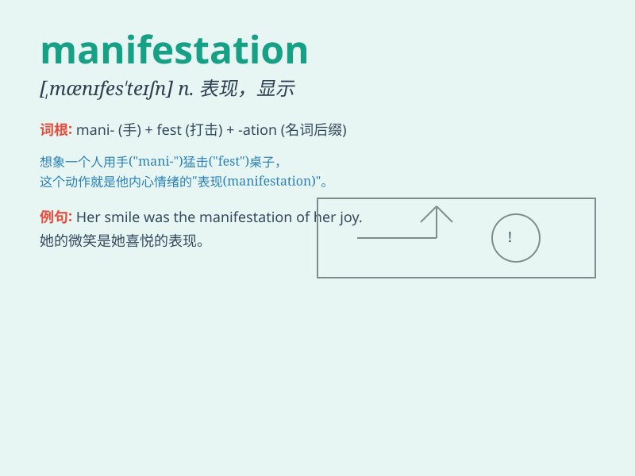

## manifestation

**英音:** _[,mænɪfe\'steɪʃ(ə)n]_ **美音:**
_[\'mænəfɛ\'steʃən]_

**译义:** *n.显示,表现,示威运动*

### 短语

+ **manifestation of disease:** _疾病的表现_

+ **manifestation of emotion:** _情感的流露_

+ **physical manifestation:** _身体上的表现_

+ **manifestation of power:** _权力的展示_

+ **spiritual manifestation:** _精神上的显现_

### 例句

#### 例句1

> **The disease is a manifestation of a deeper underlying
problem.**

**中文翻译:** 这种疾病是一个更深层次潜在问题的表现。

**单词释义:** 表现；显示

#### 例句2

> **One manifestation of her anxiety was constant fidgeting.**

**中文翻译:** 她焦虑的一种表现是不停地坐立不安。

**单词释义:** 表现；显示

#### 例句3

> **The manifestations of climate change are becoming increasingly
evident.**

**中文翻译:** 气候变化的种种表现正变得越来越明显。

**单词释义:** 表现；显示

### 背诵小故事

> A group of explorers were lost in the forest. One day, they saw a
strange light, which was the manifestation of a hidden cave. They found
treasures inside, realizing it was a sign of good luck.

**一群探险家在森林中迷路了。有一天，他们看到一束奇怪的光，这是一个隐藏洞穴的显现。他们在里面发现了宝藏，意识到这是好运的迹象。**

### 图义

