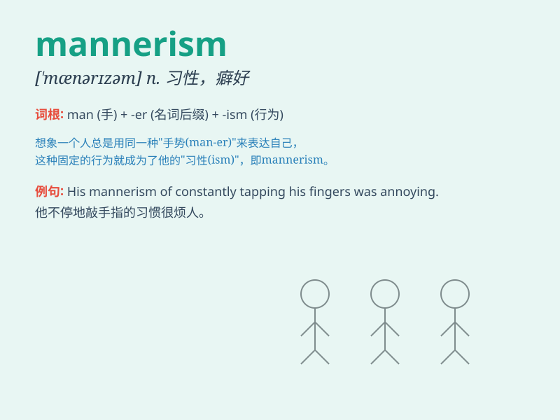

## mannerism

**英音:** _[\'mænərɪz(ə)m]_ **美音:** _[\'mænə\'rɪzəm]_

**译义:** *n.(言语、写作中的)特殊习惯,怪癖*

### 短语

+ **artistic mannerism:** _艺术风格主义_

+ **personal mannerism:** _个人习惯动作_

+ **speech mannerism:** _言语习惯_

+ **peculiar mannerism:** _独特的习惯_

+ **affected mannerism:** _做作的举止_

### 例句

#### 例句1

> **His mannerisms were very peculiar and drew a lot of
attention.**

**中文翻译:** 他的言谈举止非常奇特，引起了很多关注。

**单词释义:** 言谈举止；习性

#### 例句2

> **The actress\'s mannerisms made her character seem very real.**

**中文翻译:** 这位女演员的举止特点让她所扮演的角色显得非常真实。

**单词释义:** 举止特点

#### 例句3

> **I found his mannerisms rather charming.**

**中文翻译:** 我发现他的言谈举止相当迷人。

**单词释义:** 言谈举止

### 背诵小故事

> A painter named Tom had a unique mannerism. Every time he started a
new painting, he would twirl his brush three times. This odd behavior
was his mannerism. People recognized him by it.

**一位名叫汤姆的画家有一个独特的习惯动作。每次他开始一幅新画时，都会转动他的画笔三次。这个奇怪的行为就是他的特殊习惯、风格。人们凭此认出他。**

### 图义

