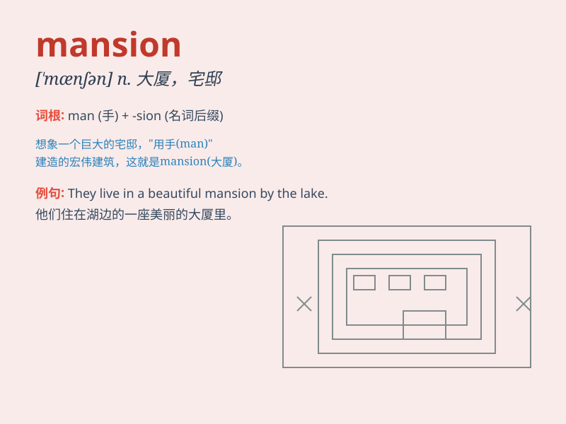

## mansion

**英音:** _[\'mænʃ(ə)n]_ **美音:** _[\'mænʃən]_

**译义:** *n.大厦,官邸,公寓(用复数,用于专有名词中)*

### 短语

+ **mansion house:** _市长官邸_

+ **country mansion:** _乡村宅邸_

+ **luxurious mansion:** _豪华宅邸_

+ **historic mansion:** _历史悠久的宅邸_

+ **grand mansion:** _宏伟的宅邸_

### 例句

#### 例句1

> **The mansion is surrounded by a beautiful garden.**

**中文翻译:** 这座宅邸被一个美丽的花园环绕着。

**单词释义:** 宅邸；大厦

#### 例句2

> **He inherited a large mansion from his grandfather.**

**中文翻译:** 他从他祖父那里继承了一座大宅子。

**单词释义:** 宅第；公馆

#### 例句3

> **The old mansion has been renovated and turned into a hotel.**

**中文翻译:** 这座古老的宅邸已经被翻新并改建成了一家酒店。

**单词释义:** 豪宅；大厦

### 背诵小故事

> A rich man was lost in a forest. When he was tired, he found a big
and beautiful mansion. It had many rooms and a lovely garden. He felt so
lucky and decided to stay there for a while.

**一个富人在森林里迷路了。当他疲惫时，发现了一座又大又漂亮的宅邸。它有很多房间和一个可爱的花园。他觉得很幸运，决定在那待一会儿。**

### 图义

