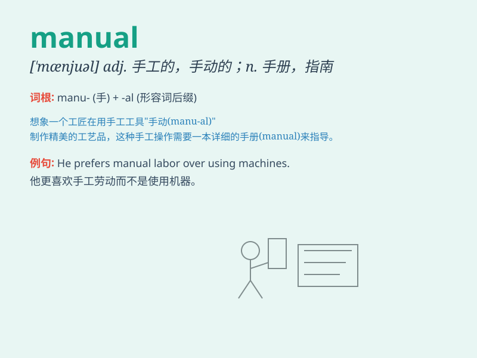

## manual

**英音:** _[\'mænjʊ(ə)l]_ **美音:** _[\'mænjuəl]_

**译义:**
*n.手册,指南adj.手的,手动的,手工的,体力的,手册(性质)的,[律]实际占有的*

### 短语

+ **manual labor:** _体力劳动_

+ **manual work:** _手工劳动；手工工作_

+ **user manual:** _用户手册；使用手册_

+ **operation manual:** _操作手册_

+ **service manual:** _维修手册；服务手册_

### 例句

#### 例句1

> **The car comes with a manual transmission.**

**中文翻译:** 这辆车配备手动变速器。

**单词释义:** 手动的

#### 例句2

> **You should read the manual carefully before operating the
machine.**

**中文翻译:** 在操作这台机器之前，你应该仔细阅读手册。

**单词释义:** 手册；指南

#### 例句3

> **Manual labor is still necessary in some industries.**

**中文翻译:** 在一些行业中，体力劳动仍然是必要的。

**单词释义:** 体力的；手工的

### 背诵小故事

>
想象一下，在一个古老的工厂里，工人拿着操作手册（manual），按照上面的步骤一步一步地手工（manual）操作着机器。手册指引他们，就像明灯照亮道路。

**想象在古老工厂中工人依照操作手册手工操作机器的情景来辅助记忆manual（手册；手工的）这个单词**

### 图义

