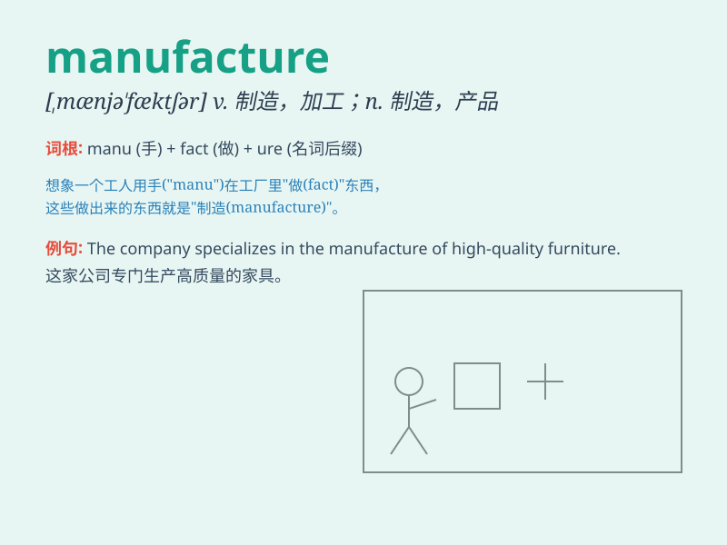

## manufacture

**英音:** _[mænjʊ\'fæktʃə]_ **美音:**
_[\'mænjə\'fæktʃɚ]_

**译义:** *vt.制造,加工n.制造,制造业,产品*

### 短语

+ **manufacture process:** _制造过程_

+ **manufacture cost:** _制造成本_

+ **manufacture plant:** _制造厂_

+ **manufacture goods:** _制造商品_

+ **domestic manufacture:** _国内制造_

### 例句

#### 例句1

> **The factory manufactures cars.**

**中文翻译:** 这家工厂制造汽车。

**单词释义:** 制造

#### 例句2

> **They manufacture furniture of high quality.**

**中文翻译:** 他们制造高质量的家具。

**单词释义:** 制造

#### 例句3

> **This company has the ability to manufacture large quantities of
goods.**

**中文翻译:** 这家公司有能力大量制造商品。

**单词释义:** 制造

### 背诵小故事

>
从前有个魔法工厂（factory），里面的工人很忙碌。他们用手（hand）制造（manufacture）各种神奇的物品。这个过程需要很多材料（material）和工具。最终，精美的产品被制造出来。

**从前有个魔法工厂，里面的工人忙碌地用手制造各种物品，这个过程需要材料和工具，最终产品被制造出来。**

### 图义

