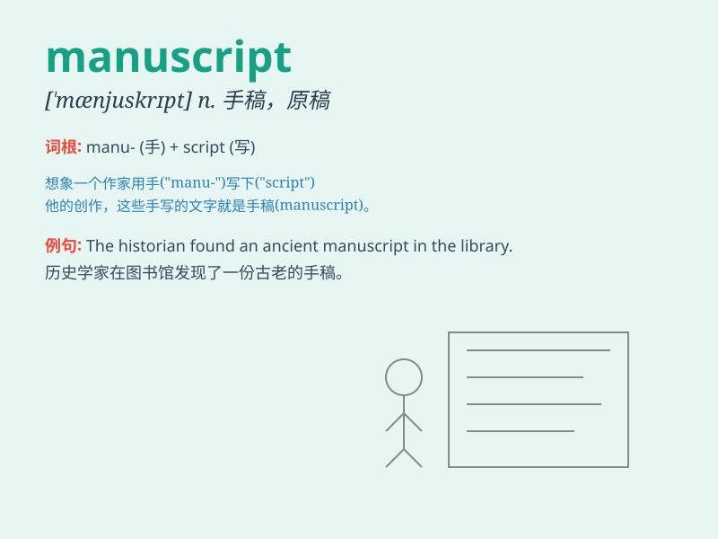

## manuscript

**英音:** _[\'mænjʊskrɪpt]_ **美音:** _[\'mænjuskrɪpt]_

**译义:** *n.手稿,原稿*

### 短语

+ **original manuscript:** _原稿_

+ **handwritten manuscript:** _手写稿_

+ **unpublished manuscript:** _未出版的手稿_

+ **lost manuscript:** _遗失的手稿_

+ **historical manuscript:** _历史手稿_

### 例句

#### 例句1

> **The author spent years working on the manuscript of his
novel.**

**中文翻译:** 这位作者花费了数年时间创作他的小说手稿。

**单词释义:** 手稿；原稿

#### 例句2

> **The librarian found a valuable manuscript hidden in the
archives.**

**中文翻译:** 图书管理员在档案中发现了一份珍贵的手稿。

**单词释义:** 手稿；原稿

#### 例句3

> **She carefully edited the manuscript before submitting it to the
publisher.**

**中文翻译:** 在把稿件提交给出版商之前，她仔细地进行了编辑。

**单词释义:** 稿件

### 背诵小故事

> 一位勇敢的冒险家 MAN ，在古老的城堡中发现了一份神秘的
SCRIPT（手稿）。这份 manuscript
记载着宝藏的秘密，他凭借它找到了无数的财富。

**一位勇敢的男子在城堡中发现记载宝藏秘密的手稿。**

### 图义

