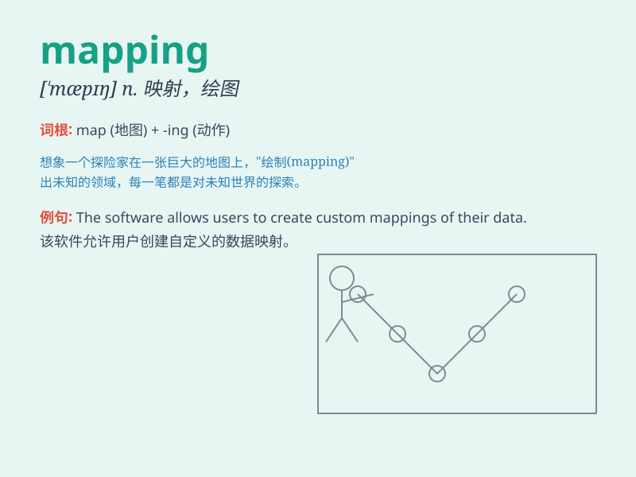

## mapping

**英音:** _[\'mæpɪŋ]_ **美音:** _[\'mæpɪŋ]_

**译义:** * vbl.映射,绘制\...之地图,计划,贴图处理*

### 短语

+ **mapping out:** _规划；筹划；安排_

+ **data mapping:** _数据映射_

+ **mind mapping:** _思维导图_

+ **feature mapping:** _特征映射_

+ **address mapping:** _地址映射_

### 例句

#### 例句1

> **The mapping of the new road system was completed last month.**

**中文翻译:** 新道路系统的绘图在上个月完成了。

**单词释义:** 绘图；地图绘制

#### 例句2

> **We need to do some mapping to understand the customer
journey.**

**中文翻译:** 我们需要做一些映射来理解客户的旅程。

**单词释义:** 映射；对应

#### 例句3

> **The mapping of genes is a complex task in genetics research.**

**中文翻译:** 基因的定位在遗传学研究中是一项复杂的任务。

**单词释义:** 定位；确定位置

### 背诵小故事

> A group of explorers were lost in a forest. But with the mapping
skills of one smart member, they drew a detailed map and finally found
their way out. The map they made is called mapping.

**一群探险家在森林里迷路了。但凭借一位聪明成员的绘图技能，他们绘制了一张详细的地图，最终找到了出路。他们绘制的这个地图就叫做
mapping。**

### 图义

