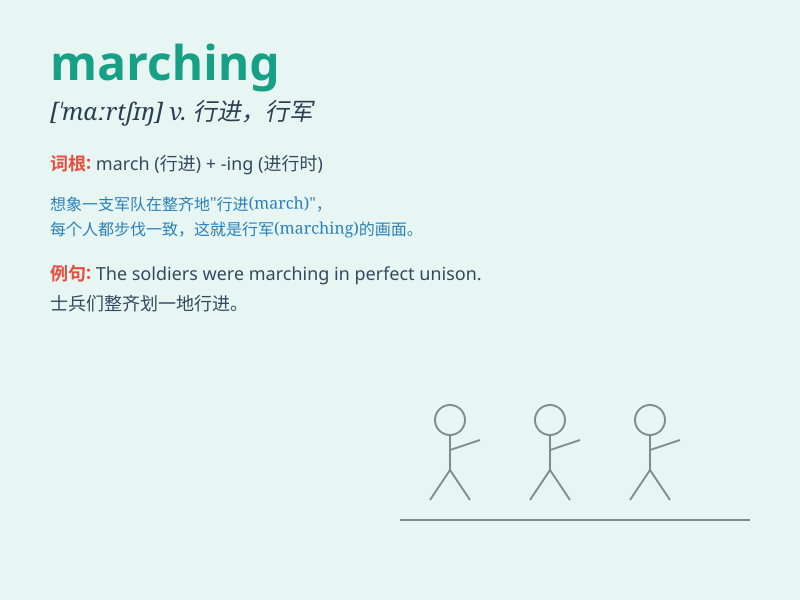

## marching

**英音:** _[ˈmaːtʃɪŋ]_ **美音:** _[ˈmɑːrtʃɪŋ]_

**译义:**
*n.行进，进行；adj.行进中的，进行中的；v.行军，前进（march
的现在分词形式）*

### 短语

+ **marching band:** _军乐队；行进乐队_

+ **marching orders:** _出发令；开拔令；驱逐令_

+ **marching step:** _正步；行军步_

+ **marching song:** _行军歌_

+ **keep marching:** _继续前进；持续行进_

### 例句

#### 例句1

> **The soldiers were marching in perfect formation.**

**中文翻译:** 士兵们正以完美的队形行进。

**单词释义:** 行进；前进

#### 例句2

> **The band was marching along the street, playing cheerful
music.**

**中文翻译:** 乐队沿着街道行进，演奏着欢快的音乐。

**单词释义:** 齐步走；行进

#### 例句3

> **The protesters were marching against the new law.**

**中文翻译:** 抗议者们游行反对新法律。

**单词释义:** 游行；示威行进

### 背诵小故事

> A group of soldiers were marching towards the battlefield. They moved
in unison, their steps firm and determined. The sound of their marching
feet was like a powerful drumbeat.

**一群士兵正在朝着战场行进。他们步伐一致，脚步坚定。他们行进的脚步声就像有力的鼓点。**

### 图义

