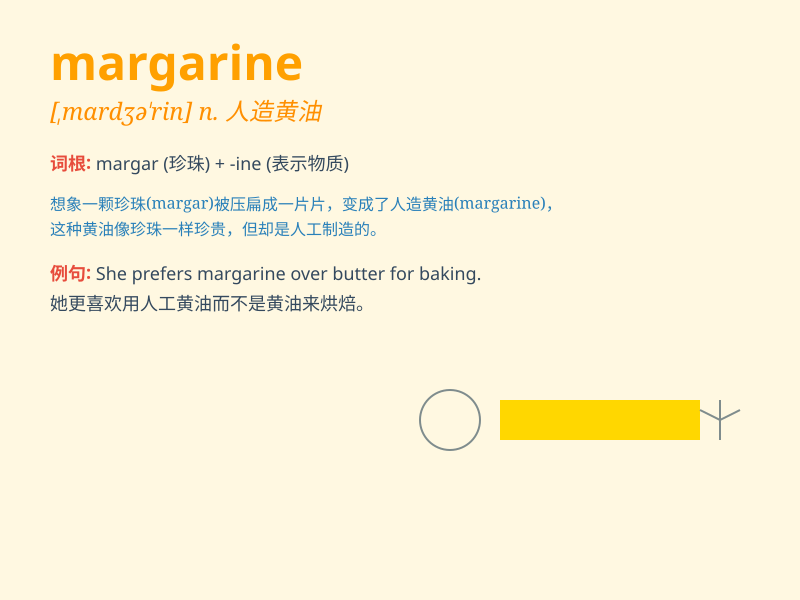

## margarine

**英音:** _[,mɑːdʒə\'riːn; \'mɑːgəriːn]_ **美音:**
_[\'mɑrdʒərən]_

**译义:** *n.人造黄油*

### 短语

+ **soft margarine:** _软质人造黄油_

+ **margarine spread:** _人造黄油涂抹酱_

+ **low-fat margarine:** _低脂人造黄油_

+ **margarine tub:** _人造黄油桶_

+ **buttery margarine:** _像黄油的人造黄油_

### 例句

#### 例句1

> **I prefer butter to margarine when baking cookies.**

**中文翻译:** 烤饼干时我更喜欢黄油而不是人造黄油。

**单词释义:** 人造黄油

#### 例句2

> **She spread margarine on her toast instead of jam.**

**中文翻译:** 她在吐司上涂了人造黄油而不是果酱。

**单词释义:** 人造黄油

#### 例句3

> **The margarine in this container has gone bad.**

**中文翻译:** 这个容器里的人造黄油已经变质了。

**单词释义:** 人造黄油

### 背诵小故事

>
想象一下，在一个神秘的花园里，有一朵神奇的花叫'margarine'。它的花瓣像奶油一样柔软，散发着独特的香味。人们发现用它能制作出美味又健康的替代品，就像我们现在用的人造黄油。

**想象在神秘花园中一朵叫'margarine'的花能制成像人造黄油的替代品**

### 图义

