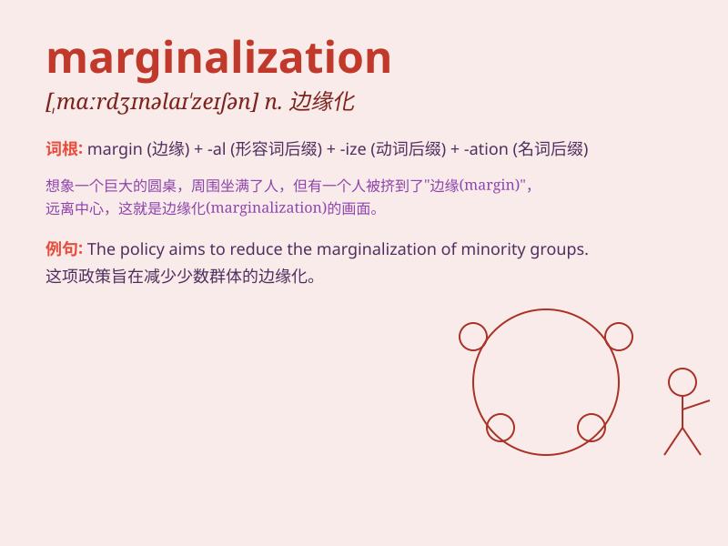

## marginalization

**英音:** _[ˌmɑːdʒɪnəlaɪˈzeɪʃn]_ **美音:**
_[ˌmɑːrdʒɪnələˈzeɪʃn]_

**译义:** *n.边缘化；忽视；排斥*

### 短语

+ **social marginalization:** _社会边缘化_

+ **economic marginalization:** _经济边缘化_

+ **marginalization effect:** _边缘化效应_

+ **prevent marginalization:** _防止边缘化_

+ **reduce marginalization:** _减少边缘化_

### 例句

#### 例句1

> **The marginalization of certain social groups is a serious problem
in modern society.**

**中文翻译:** 某些社会群体的边缘化在现代社会是一个严重的问题。

**单词释义:** 边缘化

#### 例句2

> **She felt a sense of marginalization at work because of her
gender.**

**中文翻译:** 由于她的性别，她在工作中感到被边缘化了。

**单词释义:** 被边缘化

#### 例句3

> **The policy has led to the marginalization of small
businesses.**

**中文翻译:** 这项政策导致了小企业的边缘化。

**单词释义:** 边缘化

### 背诵小故事

> A small village was constantly ignored and pushed to the margins. Its
people faced marginalization, with no access to resources or
opportunities. They felt left out and unimportant, just like the meaning
of\'marginalization\'.

**一个小村庄一直被忽视，被推到边缘。村里的人面临着边缘化，无法获得资源和机会。他们感到被遗忘和不重要，这就像"marginalization"这个词的意思。**

### 图义

