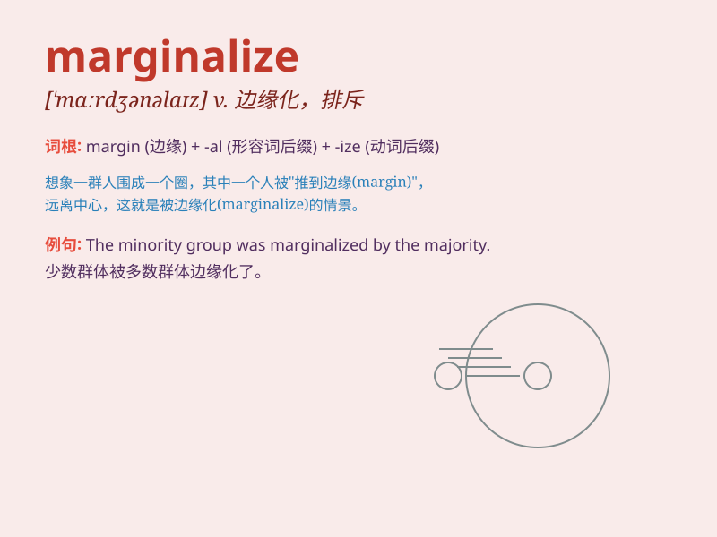

## marginalize

**英音:** _[\'mɑːdʒɪn(ə)laɪz]_ **美音:**
_[\'mɑrdʒɪnəlaɪz]_

**译义:** *vt.使处于社会边缘,使脱离社会发展进程 忽视,排斥*

### 短语

+ **marginalize someone:** _使某人边缘化_

+ **be marginalized:** _被边缘化_

+ **marginalize a group:** _使某个群体边缘化_

+ **socially marginalized:** _在社会上被边缘化_

+ **marginalize an issue:** _使某个问题被忽视_

### 例句

#### 例句1

> **The new policy has marginalized certain groups of workers.**

**中文翻译:** 新政策使某些工人群体边缘化。

**单词释义:** 使处于社会边缘；使被忽视

#### 例句2

> **She felt marginalized at the meeting and her opinions weren\'t
taken seriously.**

**中文翻译:** 她在会议上感到自己被边缘化，她的意见没有得到认真对待。

**单词释义:** 使被排斥；使不受重视

#### 例句3

> **The small company was gradually marginalized by the big ones in
the market competition.**

**中文翻译:** 小公司在市场竞争中逐渐被大公司边缘化。

**单词释义:** 使处于次要地位

### 背诵小故事

> A small company was constantly marginalized by big competitors. It
was pushed to the edge of the market, just like being on the margin. But
with hard work, it fought back and gained a place.

**一家小公司不断被大竞争对手边缘化。它被推到了市场的边缘，就像处于边缘地带一样。但通过努力，它反击并获得了一席之地。**

### 图义

