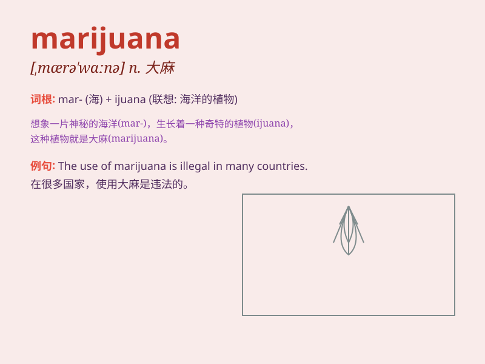

## marijuana

**英音:** _[,mærɪ\'hwɑːnə]_ **美音:** _[,mærə\'wɑnə]_

**译义:** *n.[植]大麻n.[植]大麻,大麻干叶和花*

### 短语

+ **marijuana cigarette:** _大麻烟_

+ **medical marijuana:** _医用大麻_

+ **marijuana use:** _大麻使用_

+ **marijuana cultivation:** _大麻种植_

+ **marijuana addiction:** _大麻成瘾_

### 例句

#### 例句1

> **He was arrested for possession of marijuana.**

**中文翻译:** 他因持有大麻而被捕。

**单词释义:** 大麻

#### 例句2

> **The use of marijuana is illegal in many countries.**

**中文翻译:** 在许多国家，使用大麻是非法的。

**单词释义:** 大麻

#### 例句3

> **She was caught smoking marijuana at the party.**

**中文翻译:** 她在聚会上吸食大麻被抓。

**单词释义:** 大麻

### 背诵小故事

> A young man was curious about a mysterious plant called marijuana.
One day, he tried it and got into big trouble. It affected his mind and
life. Remember, marijuana is not a good thing!

**一个年轻人对一种叫做大麻的神秘植物很好奇。有一天，他尝试了，然后陷入了大麻烦。它影响了他的心智和生活。记住，大麻不是好东西！**

### 图义

