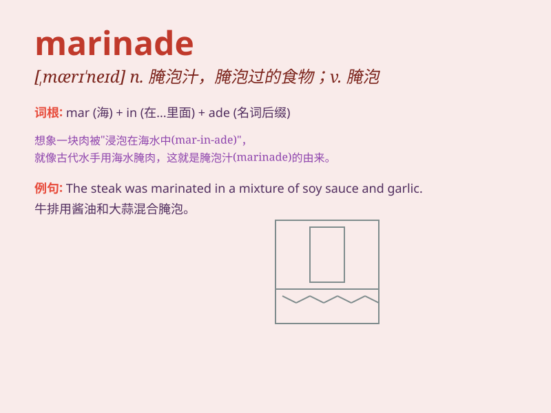

## marinade

**英音:** _[,mærɪ\'neɪd; \'mærɪneɪd]_ **美音:**
_[,mærɪ\'ned]_

**译义:** *n.腌泡汁vt.腌泡*

### 短语

+ **chicken marinade:** _鸡肉腌泡汁_

+ **marinade sauce:** _腌泡汁酱料_

+ **make a marinade:** _制作腌泡汁_

+ **spicy marinade:** _辛辣的腌泡汁_

+ **sweet marinade:** _甜的腌泡汁_

### 例句

#### 例句1

> **I prepared a delicious marinade for the chicken.**

**中文翻译:** 我为鸡肉准备了美味的腌料。

**单词释义:** 腌泡汁

#### 例句2

> **The meat was left to soak in the marinade overnight.**

**中文翻译:** 将肉放在腌料中浸泡过夜。

**单词释义:** 腌泡汁

#### 例句3

> **She added some spices to enhance the flavor of the marinade.**

**中文翻译:** 她添加了一些香料来增强腌料的味道。

**单词释义:** 腌泡汁

### 背诵小故事

> A chef was making a special dish. He put the meat in a special liquid
called marinade to make it more delicious. The marinade had many flavors
like soy sauce and herbs. It made the meat tender and full of taste.

**一位厨师正在制作一道特别的菜肴。他把肉放在一种叫做腌泡汁的特殊液体里，让肉变得更美味。这种腌泡汁有很多味道，像酱油和香草。它让肉变得鲜嫩多汁，味道十足。**

### 图义

