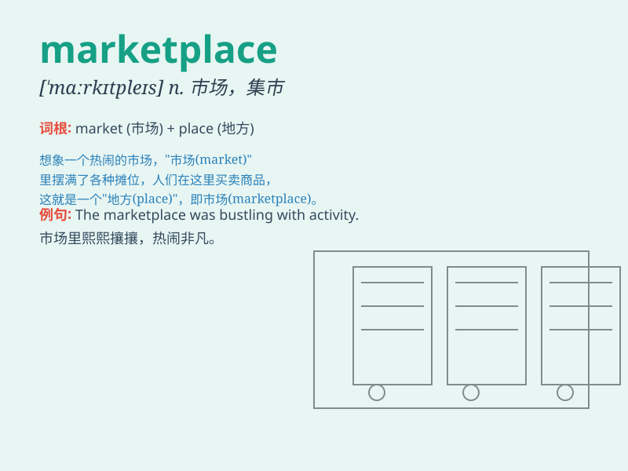

## marketplace

**英音:** _[\'mɑːkɪtpleɪs]_ **美音:** _[\'mɑrkɪtples]_

**译义:** *n.集会场所,市场 商场*

### 短语

+ **online marketplace:** _在线市场_

+ **global marketplace:** _全球市场_

+ **competitive marketplace:** _竞争激烈的市场_

+ **consumer marketplace:** _消费市场_

+ **local marketplace:** _当地市场_

### 例句

#### 例句1

> **The marketplace was bustling with people selling and buying
various goods.**

**中文翻译:** 市场上熙熙攘攘，人们买卖着各种商品。

**单词释义:** 市场；集市

#### 例句2

> **In the digital marketplace, competition is fierce.**

**中文翻译:** 在数字市场中，竞争非常激烈。

**单词释义:** 市场

#### 例句3

> **The new product quickly gained popularity in the marketplace.**

**中文翻译:** 新产品很快在市场上受到欢迎。

**单词释义:** 市场

### 背诵小故事

> In a small town, there was a lively marketplace. Every day, people
came here to buy and sell. One day, a little girl lost her toy in the
marketplace. But with the help of kind sellers, she found it. This
marketplace was full of surprises and warmth.

**在一个小镇上，有一个热闹的市场。每天，人们来这里买卖。有一天，一个小女孩在市场里丢了她的玩具。但在善良的卖家帮助下，她找到了。这个市场充满了惊喜和温暖。**

### 图义

