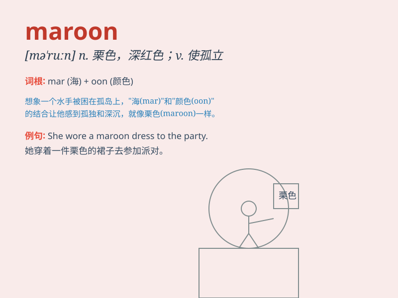

## maroon

**英音:** _[mə\'ruːn]_ **美音:** _[mə\'run]_

**译义:** *n.栗色adj.栗色的*

### 短语

+ **maroon sb on an island:** _把某人困在岛上_

+ **be marooned:** _被放逐；被困住_

+ **maroon color:** _栗色；褐红色_

+ **maroon jacket:** _栗色夹克_

+ **maroon shoes:** _栗色鞋子_

### 例句

#### 例句1

> **The treasure hunters were marooned on the desert island.**

**中文翻译:** 寻宝者被困在荒岛上。

**单词释义:** 使孤立；使无法逃脱

#### 例句2

> **She wore a maroon dress to the party.**

**中文翻译:** 她穿着一件栗色连衣裙去参加聚会。

**单词释义:** 栗色；褐红色

#### 例句3

> **The marooned sailors were eventually rescued.**

**中文翻译:** 被困的水手最终获救。

**单词释义:** 处于孤立无援困境的

### 背诵小故事

> A brave adventurer was marooned on a deserted island. He had no way
to leave and felt very lonely. But he didn\'t give up and finally found
a way to survive. \'Maroon\' means to leave someone in a desolate place
with no way to escape.

**一位勇敢的探险家被困在一个荒岛上。他无路可走，感到非常孤独。但他没有放弃，最终找到了生存的方法。\'maroon\'意思是把某人困在一个荒僻的地方无法逃脱。**

### 图义

