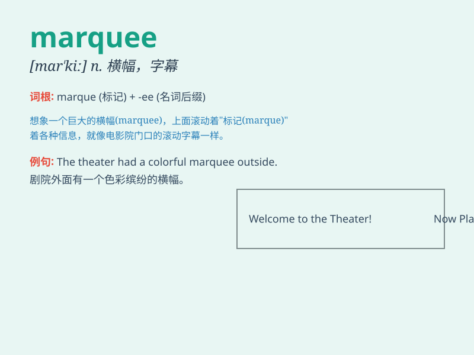

## marquee

**英音:** _[mɑː\'kiː]_ **美音:** _[mɑr\'ki]_

**译义:** *n.大帐篷,华盖n.[计]选取框*

### 短语

+ **marquee player:** _招牌球员；明星球员_

+ **marquee event:** _重大活动；重要事件_

+ **marquee sign:** _大招牌；大型标志_

+ **marquee value:** _招牌价值；显著价值_

+ **marquee name:** _著名的名字；大牌_

### 例句

#### 例句1

> **The marquee outside the theater displayed the names of the
upcoming shows.**

**中文翻译:** 剧院外的大帐篷上写着即将举行的演出的名称。

**单词释义:** 大帐篷式招牌

#### 例句2

> **The wedding was held in a marquee on the lawn.**

**中文翻译:** 婚礼在草坪上的帐篷里举行。

**单词释义:** 大帐篷

#### 例句3

> **The marquee of the football stadium was illuminated with bright
lights.**

**中文翻译:** 足球场的大帐篷被明亮的灯光照亮。

**单词释义:** 大招牌

### 背诵小故事

>
想象一下，在一个盛大的派对上，有一个巨大的、华丽的帐篷（marquee），它非常引人注目。人们在帐篷下跳舞、欢笑，这个独特的帐篷成为了派对的焦点。

**想象在派对上有一个引人注目的大帐篷来辅助记忆\'marquee（大帐篷；华盖）\'这个单词**

### 图义

