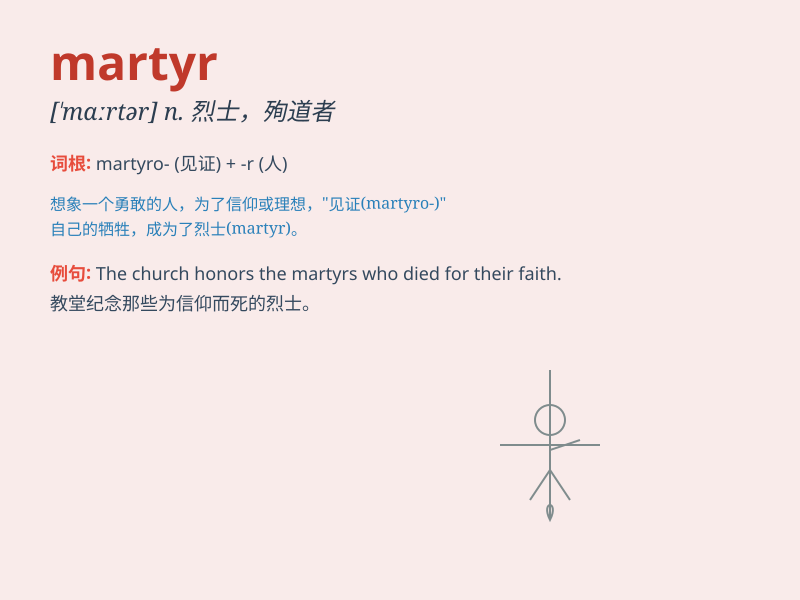

## martyr

**英音:** _[\'mɑːtə]_ **美音:** _[\'mɑrtɚ]_

**译义:** *n.烈士,殉教者v.杀害,折磨*

### 短语

+ **martyr oneself:** _牺牲自己_

+ **martyr hero:** _烈士英雄_

+ **martyr spirit:** _烈士精神_

+ **become a martyr:** _成为烈士_

+ **honor the martyr:** _缅怀烈士_

### 例句

#### 例句1

> **He was regarded as a martyr for his sacrifice in the war.**

**中文翻译:** 由于他在战争中的牺牲，他被视为烈士。

**单词释义:** 烈士

#### 例句2

> **The martyr\'s deeds inspired generations of people.**

**中文翻译:** 烈士的事迹激励了几代人。

**单词释义:** 烈士

#### 例句3

> **She became a martyr for the cause of freedom.**

**中文翻译:** 她成为自由事业的烈士。

**单词释义:** 殉道者

### 背诵小故事

> A brave soldier named Tom refused to surrender in the battle. He
fought to the end and sacrificed his life. People called him a martyr
because of his heroic and selfless act.

**一位名叫汤姆的勇敢士兵在战斗中拒绝投降。他战斗到最后一刻并献出了生命。由于他英勇和无私的行为，人们称他为烈士。**

### 图义

