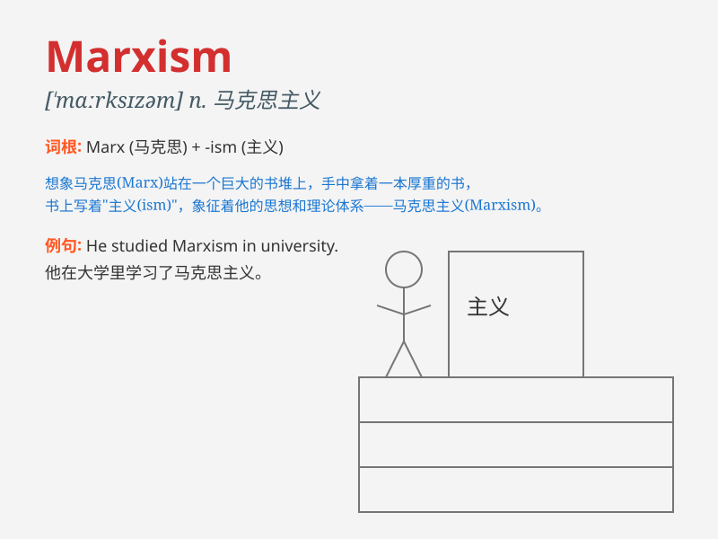

## Marxism

**英音:** _[ˈmɑːksɪzəm]_ **美音:** _[ˈmɑːrksɪzəm]_

**译义:** *n.马克思主义*

### 短语

+ **Scientific Marxism:** _科学马克思主义_

+ **Marxism-Leninism:** _马克思列宁主义_

+ **Classical Marxism:** _经典马克思主义_

+ **Western Marxism:** _西方马克思主义_

+ **Contemporary Marxism:** _当代马克思主义_

### 例句

#### 例句1

> **He devoted himself to the study of Marxism.**

**中文翻译:** 他致力于马克思主义的研究。

**单词释义:** 马克思主义

#### 例句2

> **Marxism has had a profound impact on modern society.**

**中文翻译:** 马克思主义对现代社会产生了深远的影响。

**单词释义:** 马克思主义

#### 例句3

> **The course covers the basic principles of Marxism.**

**中文翻译:** 这门课程涵盖了马克思主义的基本原理。

**单词释义:** 马克思主义

### 背诵小故事

> One day, a student was confused about social theories. Then, a wise
teacher introduced him to Marxism, explaining how it aims for a fair and
equal society. The student was enlightened and began to explore this
powerful idea.

**有一天，一个学生对社会理论感到困惑。然后，一位睿智的老师向他介绍了马克思主义，解释它如何致力于一个公平和平等的社会。这个学生受到启发，开始探索这个强大的思想。**

### 图义

