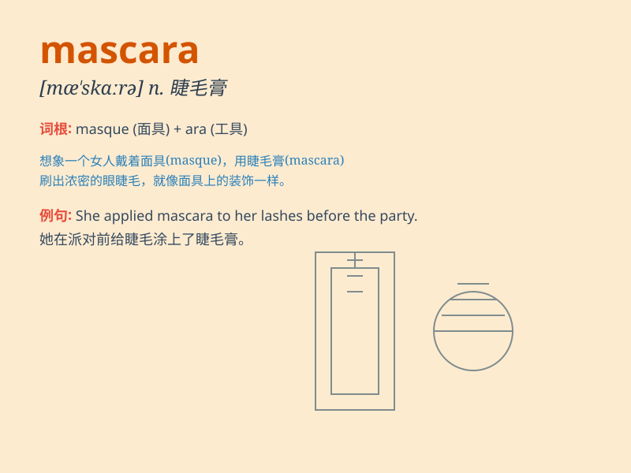

## mascara

**英音:** _[mæ\'skɑːrə]_ **美音:** _[mæ\'skærə]_

**译义:** *n.染眉毛油vi.涂染眉毛油*

### 短语

+ **mascara wand:** _睫毛刷_

+ **waterproof mascara:** _防水睫毛膏_

+ **volumizing mascara:** _浓密型睫毛膏_

+ **long-lasting mascara:** _持久型睫毛膏_

+ **curling mascara:** _卷翘型睫毛膏_

### 例句

#### 例句1

> **She applied mascara to her eyelashes to make them look
longer.**

**中文翻译:** 她在睫毛上涂了睫毛膏，让睫毛看起来更长。

**单词释义:** 睫毛膏

#### 例句2

> **The mascara smudged and left black marks under her eyes.**

**中文翻译:** 睫毛膏弄脏了，在她的眼睛下面留下了黑色的痕迹。

**单词释义:** 睫毛膏

#### 例句3

> **I need to buy a new tube of mascara because mine is running
out.**

**中文翻译:** 我需要买一管新的睫毛膏，因为我的睫毛膏快用完了。

**单词释义:** 睫毛膏

### 背诵小故事

> A girl was going to a party. She forgot to bring her mascara. So she
had no choice but to go home and get it. Without mascara, her eyes
looked plain. Mascara really makes a big difference!

**一个女孩要去参加派对。她忘了带睫毛膏。所以她别无选择只能回家去拿。没有睫毛膏，她的眼睛看起来很平淡。睫毛膏真的差别很大！**

### 图义

