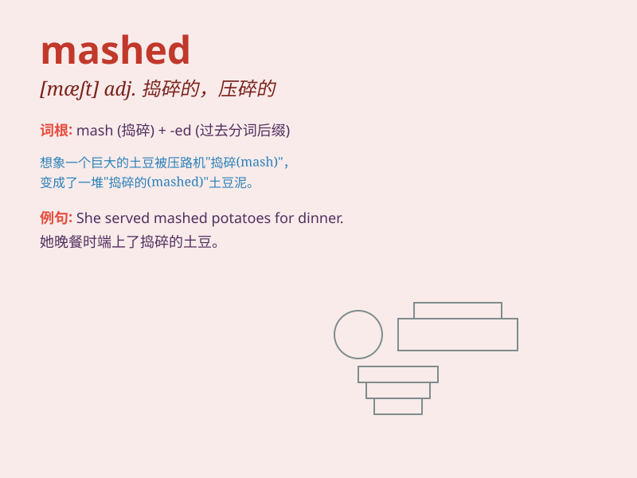

## mashed

**英音:** _[mæʃt]_ **美音:** _[mæʃt]_

**译义:** *adj. 捣碎的，压碎的；糊状的；喝醉的 v.
捣碎（mash的过去式和过去分词）*

### 短语

+ **mashed potatoes:** _土豆泥_

+ **mashed banana:** _香蕉泥_

+ **mashed peas:** _豌豆泥_

+ **mashed turnip:** _萝卜泥_

+ **mashed pumpkin:** _南瓜泥_

### 例句

#### 例句1

> **I like mashed potatoes very much.**

**中文翻译:** 我非常喜欢土豆泥。

**单词释义:** 捣碎的，捣烂的（形容土豆）

#### 例句2

> **The doctor applied some mashed herbs to the wound.**

**中文翻译:** 医生在伤口上敷了一些捣碎的草药。

**单词释义:** 捣碎的（形容草药）

#### 例句3

> **She made mashed bananas for the baby.**

**中文翻译:** 她为宝宝做了香蕉泥。

**单词释义:** 捣烂成泥状的（形容香蕉）

### 背诵小故事

> One day, I was very hungry. I opened the fridge and found some
potatoes. I cooked and mashed them to make a delicious mashed potato
dish. It was so yummy!

**有一天，我非常饿。我打开冰箱发现了一些土豆。我把它们煮了然后捣成泥，做了一道美味的土豆泥菜肴。真是太好吃了！**

### 图义

