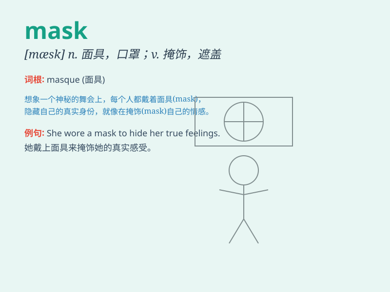

## mask

**英音:** _[mɑːsk]_ **美音:** _[mæsk]_

**译义:**
*n.面具,掩饰,石膏面像vt.戴面具,掩饰,使模糊vi.化装,戴面具,掩饰,参加化装舞会*

### 短语

+ **face mask:** _口罩；面罩_

+ **gas mask:** _防毒面具_

+ **mask off:** _脱掉面具；揭露_

+ **mask up:** _戴上口罩；戴上面具_

+ **sleep mask:** _睡眠眼罩_

### 例句

#### 例句1

> **She wore a mask to hide her identity.**

**中文翻译:** 她戴着面具来隐藏自己的身份。

**单词释义:** 面具；面罩

#### 例句2

> **The doctor put on a surgical mask before the operation.**

**中文翻译:** 医生在手术前戴上了外科口罩。

**单词释义:** 口罩

#### 例句3

> **His smile was a mask for his sadness.**

**中文翻译:** 他的微笑掩盖了他的悲伤。

**单词释义:** 掩饰；伪装

### 背诵小故事

> A thief wore a mask to hide his face when stealing. But the police
found a hair on the mask and caught him. The mask couldn\'t protect the
thief forever.

**一个小偷在偷窃时戴着面具来隐藏他的脸。但警察在面具上发现了一根头发并抓住了他。面具不能永远保护小偷。**

### 图义

