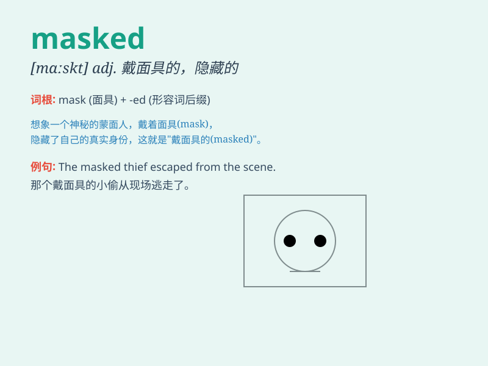

## masked

**英音:** _[mɑːskt]_ **美音:** _[mæskt]_

**译义:** *v.伪装adj.戴面具的*

### 短语

+ **masked ball:** _化妆舞会_

+ **masked face:** _蒙面的脸_

+ **masked thief:** _蒙面盗贼_

+ **masked emotion:** _隐藏的情感_

+ **masked identity:** _隐藏的身份_

### 例句

#### 例句1

> **The thief wore a masked costume to hide his identity.**

**中文翻译:** 小偷穿着蒙面服装来隐藏自己的身份。

**单词释义:** 蒙面的；戴面具的

#### 例句2

> **She had a masked expression, making it hard to tell what she was
thinking.**

**中文翻译:** 她表情阴郁，让人很难看出她在想什么。

**单词释义:** 掩饰的；伪装的

#### 例句3

> **The masked dancers moved gracefully on the stage.**

**中文翻译:** 蒙面舞者在舞台上翩翩起舞。

**单词释义:** 蒙面的

### 背诵小故事

> A thief wore a masked costume to hide his face when stealing. But the
police were smart and found him because of a small mark on his mask.
\'Masked\' means having a mask covering your face.

**一个小偷在偷窃时穿着蒙面的服装来遮住脸。但是警察很聪明，因为他面具上的一个小记号发现了他。\'masked\'意思是戴着面具的，蒙面的。**

### 图义

