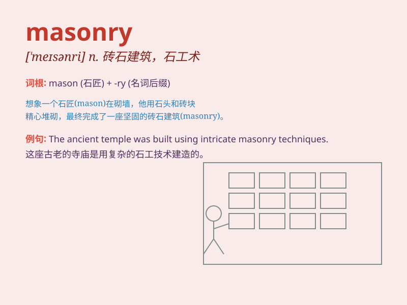

## masonry

**英音:** _[\'meɪs(ə)nrɪ]_ **美音:** _[\'mesənri]_

**译义:** *n.石工术,石匠职业*

### 短语

+ **stone masonry:** _石工_

+ **brick masonry:** _砌砖_

+ **masonry wall:** _砌石墙；砖石墙_

+ **masonry structure:** _砖石结构；砌体结构_

+ **masonry work:** _砖石工程；砌石工程_

### 例句

#### 例句1

> **The masonry of the old church was exquisite.**

**中文翻译:** 老教堂的砖石建筑非常精美。

**单词释义:** 砖石建筑；砌砖

#### 例句2

> **He learned the skills of masonry at a young age.**

**中文翻译:** 他年轻时就学会了砌石技能。

**单词释义:** 砌砖（的工作或技术）

#### 例句3

> **The strength of the building lies in its solid masonry.**

**中文翻译:** 这座建筑的强度在于其坚固的砖石结构。

**单词释义:** 砖石结构

### 背诵小故事

> A young man named Tom wanted to build a beautiful house. He learned
the skill of masonry and spent days laying bricks carefully. Finally,
his house with solid masonry stood firm and became the envy of the
village.

**一个叫汤姆的年轻人想要建造一座漂亮的房子。他学习了砌石技艺，花了好些天认真砌砖。最终，他那有着坚固砖石结构的房子稳稳矗立，成了村里让人羡慕的存在。**

### 图义

