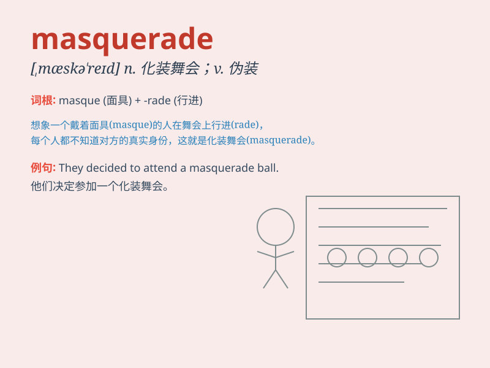

## masquerade

**英音:** _[,mɑːskə\'reɪd; ,mæs-]_ **美音:**
_[,mæskə\'red]_

**译义:** *n.化妆舞会v.化装*

### 短语

+ **masquerade ball:** _化妆舞会_

+ **masquerade costume:** _化妆舞会服装_

+ **masquerade party:** _化妆派对_

+ **go to a masquerade:** _去参加化妆舞会_

+ **wear a masquerade mask:** _戴一个化妆舞会面具_

### 例句

#### 例句1

> **She attended the party in a masquerade costume.**

**中文翻译:** 她穿着化装舞会服装参加了聚会。

**单词释义:** 化装舞会

#### 例句2

> **His kindness was just a masquerade to hide his true
intentions.**

**中文翻译:** 他的善意只是为了掩饰自己的真实意图而做的伪装。

**单词释义:** 伪装；掩饰

#### 例句3

> **The criminal used a masquerade to escape from the police.**

**中文翻译:** 罪犯利用化装舞会来逃避警方的追捕。

**单词释义:** 伪装；假扮

### 背诵小故事

> A prince was forced to masquerade as a commoner to escape enemies. He
wore a mask and changed his clothes. But in the end, his true identity
was revealed when the mask fell off.

**一位王子被迫伪装成平民以躲避敌人。他戴着面具，换了衣服。但最后，当面具掉落时，他的真实身份暴露了。**

### 图义

