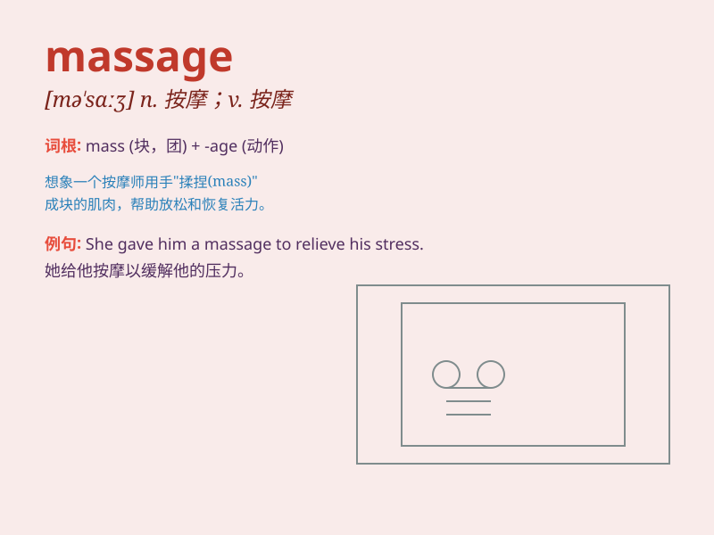

## massage

**英音:** _[\'mæsɑːʒ; mə\'sɑːʒ; -dʒ]_ **美音:**
_[mə\'sɑʒ]_

**译义:** *n.按摩v.按摩*

### 短语

+ **foot massage:** _足部按摩_

+ **body massage:** _身体按摩_

+ **massage chair:** _按摩椅_

+ **massage therapy:** _按摩疗法_

+ **give a massage:** _进行按摩_

### 例句

#### 例句1

> **I enjoy a relaxing massage after a long day at work.**

**中文翻译:** 经过一整天的工作后，我享受放松的按摩。

**单词释义:** 按摩

#### 例句2

> **The therapist will massage your shoulders to relieve the
tension.**

**中文翻译:** 治疗师会按摩您的肩膀以缓解紧张。

**单词释义:** 按摩

#### 例句3

> **She gave her feet a gentle massage.**

**中文翻译:** 她轻轻地按摩她的脚。

**单词释义:** 按摩

### 背诵小故事

>
有一天，小明工作累得腰酸背痛，于是去了一家按摩店。按摩师熟练地用双手为他进行按摩（massage），舒缓了他的肌肉紧张，让他感到无比放松。

**有一天，小明工作累了去按摩店接受按摩师的按摩，从而记住 massage
这个单词表示按摩的意思。**

### 图义

