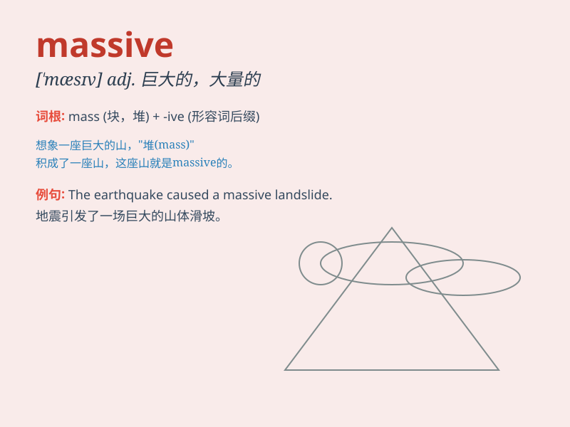

## massive

**英音:** _[\'mæsɪv]_ **美音:** _[\'mæsɪv]_

**译义:** *adj.厚重的,大块的,魁伟的,结实的*

### 短语

+ **massive attack:** _大规模攻击_

+ **massive dose:** _大剂量_

+ **massive structure:** _大型结构_

+ **massive unemployment:** _大量失业_

+ **massive project:** _大型项目_

### 例句

#### 例句1

> **The earthquake caused a massive destruction.**

**中文翻译:** 地震造成了巨大的破坏。

**单词释义:** 巨大的

#### 例句2

> **He has a massive collection of stamps.**

**中文翻译:** 他收藏了大量邮票。

**单词释义:** 大量的

#### 例句3

> **The company needs to undertake a massive reorganization.**

**中文翻译:** 该公司需要进行大规模重组。

**单词释义:** 大规模的

### 背诵小故事

>
想象一下，你正在参观一座古老的城堡。城堡的大门无比厚重，是由巨大的石块砌成，那种震撼的感觉就如同\'massive\'所表达的。这扇大门巨大无比，给人一种难以撼动的力量感。

**想象你参观古老城堡，其厚重的大门由巨大石块砌成，这种震撼的巨大感就像\'massive\'所表达的，即巨大的、大量的、大规模的**

### 图义

