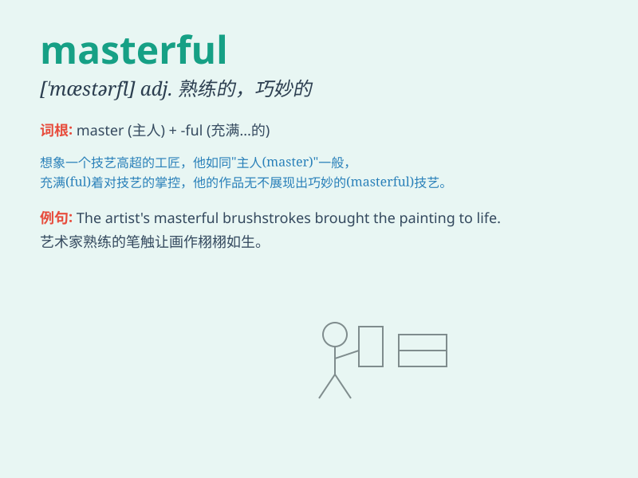

## masterful

**英音:** _[\'mɑːstəfʊl; -f(ə)l]_ **美音:**
_[\'mæstɚfl]_

**译义:** *adj.专横的*

### 短语

+ **masterful performance:** _出色的表演_

+ **masterful control:** _高超的控制_

+ **masterful handling:** _熟练的处理_

+ **masterful leadership:** _卓越的领导才能_

+ **masterful strategy:** _高明的策略_

### 例句

#### 例句1

> **The chef\'s masterful cooking skills were on display in every
dish.**

**中文翻译:** 每一道菜都展现了厨师高超的烹饪技巧。

**单词释义:** 精湛的

#### 例句2

> **She gave a masterful performance on the piano.**

**中文翻译:** 她在钢琴上进行了精湛的演奏。

**单词释义:** 出色的

#### 例句3

> **The artist\'s masterful use of color made the painting come
alive.**

**中文翻译:** 画家对色彩的巧妙运用使这幅画变得栩栩如生。

**单词释义:** 巧妙的

### 背诵小故事

> A young artist was always struggling. One day, he met a masterful
painter. The painter showed him perfect techniques and confident
strokes. Inspired by the masterful artist, the young one improved
greatly.

**一位年轻的艺术家总是苦苦挣扎。有一天，他遇到了一位技艺精湛的画家。这位画家向他展示了完美的技巧和自信的笔触。受到这位技艺精湛的画家的启发，年轻的艺术家进步很大。**

### 图义

