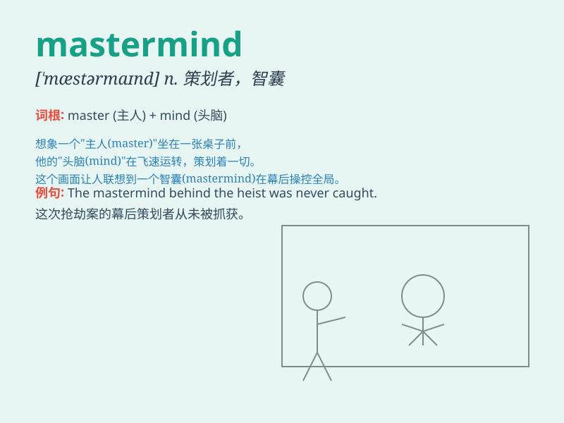

## mastermind

**英音:** _[\'mɑːstəmaɪnd]_ **美音:** _[\'mæstəmaɪnd]_

**译义:** *v.策划*

### 短语

+ **criminal mastermind:** _犯罪主谋_

+ **the mastermind behind:** _幕后策划者_

+ **mastermind a plan:** _策划一个计划_

+ **mastermind a conspiracy:** _策划阴谋_

+ **creative mastermind:** _创意大师_

### 例句

#### 例句1

> **The criminal mastermind was finally caught by the police.**

**中文翻译:** 犯罪主谋最终被警方抓获。

**单词释义:** 策划者；主谋

#### 例句2

> **She is the mastermind behind this successful marketing
campaign.**

**中文翻译:** 她是这次成功营销活动背后的策划者。

**单词释义:** 策划者；主谋

#### 例句3

> **The mastermind of the robbery had planned every detail
carefully.**

**中文翻译:** 抢劫案的主谋对每一个细节都进行了精心策划。

**单词释义:** 主谋

### 背诵小故事

> A brilliant detective was known as the mastermind. He could solve the
most complex cases. His sharp mind was like a master key, unlocking
every mystery. With his wisdom, no crime could escape his understanding.

**一位杰出的侦探被称为策划者。他能解决最复杂的案件。他敏锐的头脑就像一把万能钥匙，解开每一个谜团。凭借他的智慧，任何犯罪都逃不过他的洞察。**

### 图义

