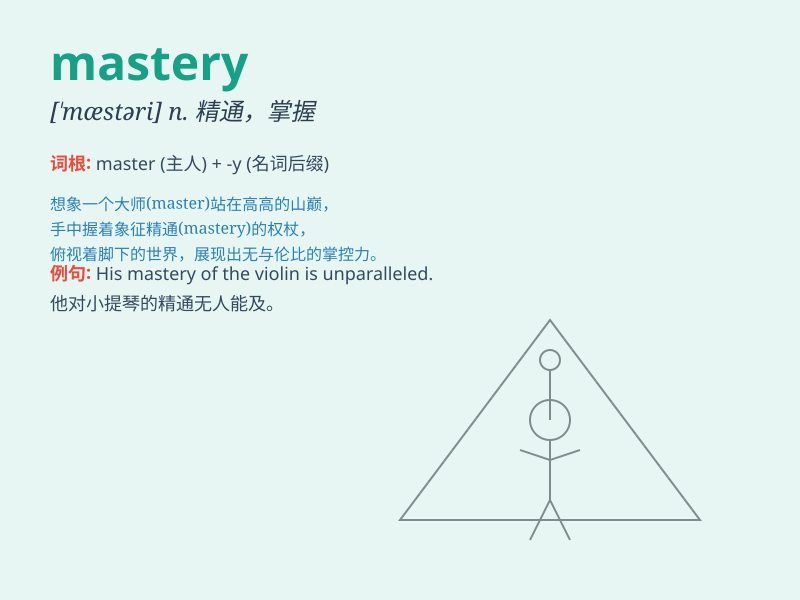

## mastery

**英音:** _[\'mɑːst(ə)rɪ]_ **美音:** _[\'mæstəri]_

**译义:** *n.掌握*

### 短语

+ **mastery of:** _对\...\...的精通；对\...\...的掌握_

+ **language mastery:** _语言掌握能力_

+ **academic mastery:** _学术精通_

+ **skill mastery:** _技能精通_

+ **mastery level:** _精通水平_

### 例句

#### 例句1

> **His mastery of the piano is remarkable.**

**中文翻译:** 他对钢琴的掌握非常出色。

**单词释义:** 精通；熟练掌握

#### 例句2

> **The athlete\'s mastery of the sport led to numerous
victories.**

**中文翻译:** 这位运动员对这项运动的掌握带来了无数的胜利。

**单词释义:** 精通；熟练掌握

#### 例句3

> **She demonstrated complete mastery of the subject matter.**

**中文翻译:** 她表现出对主题的完全掌握。

**单词释义:** 精通；熟练掌握

### 背诵小故事

> A young boy dreamed of achieving mastery in playing the piano. He
practiced every day, facing difficulties but never giving up. Finally,
his hard work paid off, and he gained mastery over the instrument.

**一个小男孩梦想在弹钢琴方面达到精通。他每天练习，面对困难但从不放弃。最终，他的努力得到了回报，他精通了这门乐器。**

### 图义

