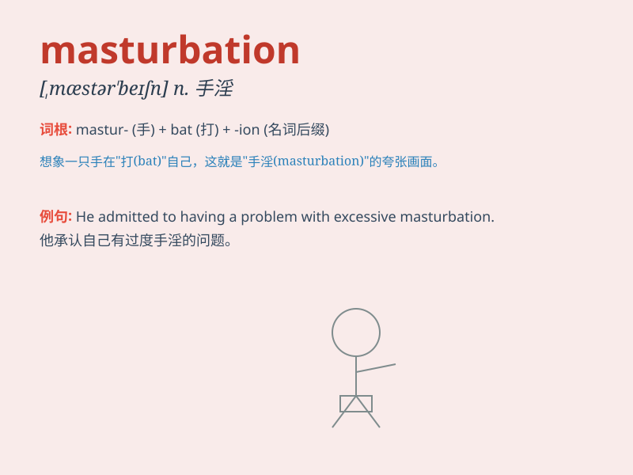

## masturbation

**英音:** _[,mæstə\'beɪʃən]_ **美音:** _[,mæstɚ\'beʃən]_

**译义:** *n.手淫,自淫*

### 短语

+ **masturbation habit:** _自慰习惯_

+ **chronic masturbation:** _慢性自慰_

+ **excessive masturbation:** _过度自慰_

+ **masturbation frequency:** _自慰频率_

+ **masturbation behavior:** _自慰行为_

### 例句

#### 例句1

> **Masturbation is a private and personal activity that some people
engage in.**

**中文翻译:** 手淫是一些人从事的私人和个人活动。

**单词释义:** 自慰

#### 例句2

> **Excessive masturbation can sometimes have negative effects on
one\'s physical and mental health.**

**中文翻译:** 过度手淫有时会对一个人的身心健康产生负面影响。

**单词释义:** 自慰

#### 例句3

> **He was ashamed of his past history of masturbation.**

**中文翻译:** 他对自己过去的手淫史感到羞耻。

**单词释义:** 自慰

### 背诵小故事

> A boy was alone in his room one night and started touching himself in
a way that is called masturbation. But he knew it was a private thing
and should be done with caution.

**一天晚上，一个男孩独自在房间里，开始以一种被称为自慰的方式触摸自己。但他知道这是一件私密的事，应该谨慎对待。**

### 图义

