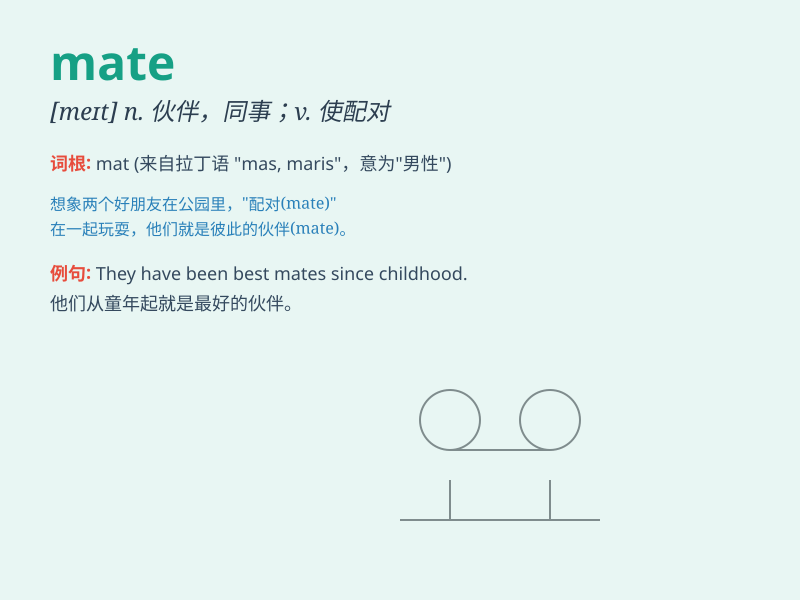

## mate

**英音:** _[meɪt]_ **美音:** _[met]_

**译义:**
*n.配偶,对手,助手vt.使配对,使一致,结伴vi.成配偶,紧密配合*

### 短语

+ **classmate:** _同班同学_

+ **roommate:** _室友_

+ **soul mate:** _灵魂伴侣_

+ **workmate:** _同事；工友_

+ **teammate:** _队友_

### 例句

#### 例句1

> **The lioness chose a strong mate.**

**中文翻译:** 母狮选择了一个坚强的伴侣。

**单词释义:** 配偶；伴侣

#### 例句2

> **I\'m going fishing with my mate Tom.**

**中文翻译:** 我要和我的朋友汤姆去钓鱼。

**单词释义:** 伙伴；朋友

#### 例句3

> **The two pieces are a perfect mate.**

**中文翻译:** 这两件作品是完美的搭档。

**单词释义:** 匹配；相配

### 背诵小故事

> One day, a little monkey was looking for its mate in the forest. It
called out loudly, hoping to find its partner. Finally, it found its
mate and they played happily together.

**一天，一只小猴子在森林里寻找它的配偶。它大声呼喊，希望能找到它的伴侣。最后，它找到了它的配偶，它们一起快乐地玩耍。**

### 图义

