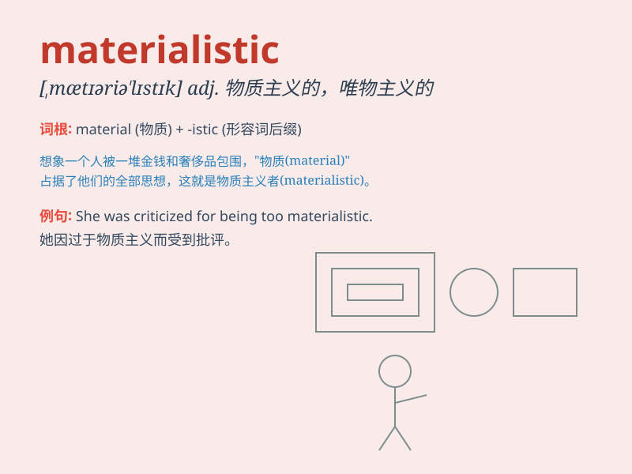

## materialistic

**英音:** _[mə,tɪərɪə\'lɪstɪk]_ **美音:**
_[mə\'tɪrɪə\'lɪstɪk]_

**译义:** *adj.唯物论的,唯物主义的*

### 短语

+ **materialistic society:** _物质主义的社会_

+ **materialistic values:** _物质主义价值观_

+ **become materialistic:** _变得物质主义_

+ **highly materialistic:** _高度物质主义的_

+ **materialistic pursuit:** _物质主义的追求_

### 例句

#### 例句1

> **In today\'s materialistic society, many people pursue wealth at
the expense of their happiness.**

**中文翻译:**
在当今物欲横流的社会，许多人为了追求财富而牺牲了自己的幸福。

**单词释义:** 物质主义的；实利主义的

#### 例句2

> **She has a materialistic attitude towards life and only cares
about material possessions.**

**中文翻译:** 她的生活态度是物质主义的，只关心物质财富。

**单词释义:** 追求物质的；贪图物质享受的

#### 例句3

> **The materialistic culture often leads people to lose sight of
true values.**

**中文翻译:** 物质至上的文化常常导致人们忽视真正的价值观。

**单词释义:** 物质至上的

### 背诵小故事

> A girl always chases after brand-name bags and expensive clothes. She
only cares about material things and ignores true feelings. We call her
materialistic. She forgets that happiness doesn\'t come from
possessions.

**一个女孩总是追求名牌包和昂贵的衣服。她只在乎物质的东西，忽略了真实的感情。我们称她为物质主义的。她忘记了幸福并非来自于财产。**

### 图义

