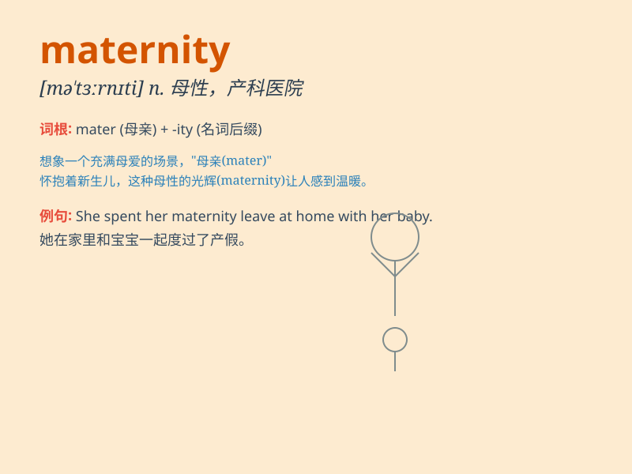

## maternity

**英音:** _[mə\'tɜːnɪtɪ]_ **美音:** _[mə\'tɝnəti]_

**译义:** *n.母性,母道adj.孕妇的,产妇的,产科的*

### 短语

+ **maternity leave:** _产假_

+ **maternity hospital:** _产科医院_

+ **maternity dress:** _孕妇装_

+ **maternity ward:** _产科病房_

+ **maternity care:** _产妇护理_

### 例句

#### 例句1

> **She took maternity leave when she was pregnant.**

**中文翻译:** 她怀孕时休了产假。

**单词释义:** 产假；孕妇的

#### 例句2

> **The hospital has a dedicated maternity ward.**

**中文翻译:** 这家医院有专门的产科病房。

**单词释义:** 产妇的；产科的

#### 例句3

> **Maternity clothes are designed to be comfortable during
pregnancy.**

**中文翻译:** 孕妇装的设计是为了在怀孕期间穿着舒适。

**单词释义:** 孕妇的；产妇的

### 背诵小故事

> A woman was very excited about her maternity. She dreamt of holding
her baby in her arms, feeling the joy and warmth of motherhood.
Maternity means the state of being a mother and the period of time
during pregnancy and after giving birth.

**一位女士对她的孕产状态非常兴奋。她梦想着将宝宝抱在怀中，感受着为人母的喜悦和温暖。maternity
意思是作为母亲的状态以及怀孕和分娩后的时期。**

### 图义

