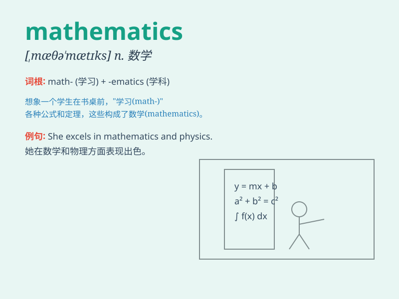

## mathematics

**英音:** _[mæθ(ə)\'mætɪks]_ **美音:** _[,mæθə\'mætɪks]_

**译义:** *n.数学*

### 短语

+ **mathematics teacher:** _数学老师_

+ **mathematics book:** _数学书_

+ **mathematics department:** _数学系_

+ **mathematics problem:** _数学问题_

+ **mathematics student:** _数学专业的学生_

### 例句

#### 例句1

> **I have always struggled with mathematics at school.**

**中文翻译:** 我在学校的时候一直数学学得很吃力。

**单词释义:** 数学

#### 例句2

> **She is majoring in mathematics at the university.**

**中文翻译:** 她在大学里主修数学。

**单词释义:** 数学

#### 例句3

> **Mathematics is an essential subject for many careers.**

**中文翻译:** 数学对于许多职业来说是一门重要的学科。

**单词释义:** 数学

### 背诵小故事

>
小明非常害怕数学（mathematics）考试，每次都紧张得不行。有一天他梦到数学书变成了会说话的精灵，教他解题，从此他不再害怕，成绩也提高了。

**小明对数学考试感到恐惧，梦到数学书精灵帮助他后不再害怕，成绩提升的故事**

### 图义

