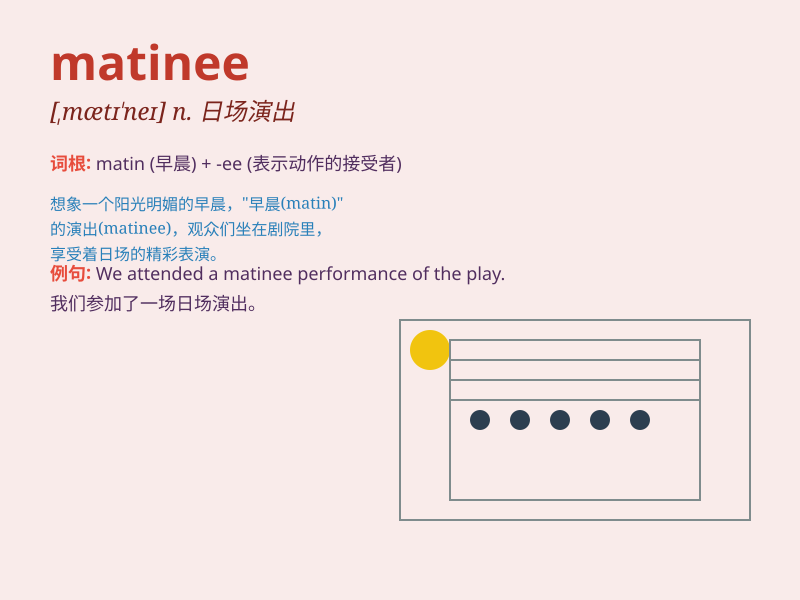

## matinee

**英音:** _[\'mætɪneɪ]_ **美音:** _[,mætn\'e]_

**译义:** *n.白天举行的音乐会,妇女便装之一种*

### 短语

+ **matinee idol:** _受女观众喜爱的男演员_

+ **matinee performance:** _日场演出_

+ **matinee jacket:** _一种短上衣_

+ **matinee coat:** _一种女式短上衣_

+ **matinee girl:** _喜欢看日场演出的女孩_

### 例句

#### 例句1

> **I went to a matinee of the new movie yesterday.**

**中文翻译:** 我昨天去看了新电影的日场。

**单词释义:** 日场（演出、电影等）

#### 例句2

> **The theater offers discounted tickets for matinee shows.**

**中文翻译:** 这家剧院为日场演出提供打折票。

**单词释义:** 日场

#### 例句3

> **We decided to catch the matinee performance of the play.**

**中文翻译:** 我们决定去看这场戏的日场演出。

**单词释义:** 日场演出

### 背诵小故事

> One day, Tom was excited to go to a matinee show. He arrived early,
got a good seat, and enjoyed the performance in the afternoon. It was a
special time for him.

**一天，汤姆很兴奋地去看日场演出。他早早到达，占到了好座位，并在下午愉快地欣赏了表演。对他来说这是一段特别的时光。**

### 图义

