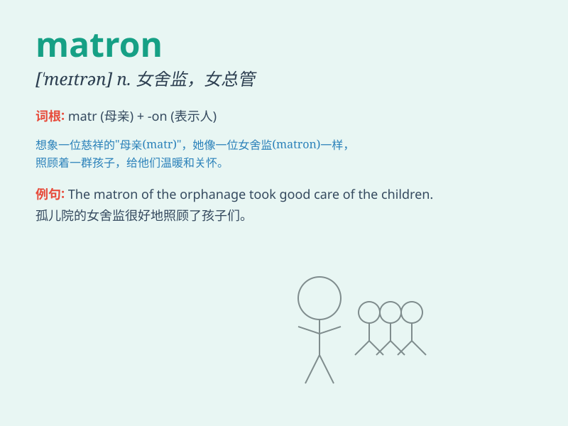

## matron

**英音:** _[\'meɪtr(ə)n]_ **美音:** _[\'metrən]_

**译义:** *n.护土长,女舍监,保姆,主妇*

### 短语

+ **head matron:** _女舍监主管_

+ **matron of honor:** _伴娘；主伴娘_

+ **ward matron:** _病房护士长_

+ **school matron:** _学校女舍监_

+ **chief matron:** _总护士长_

### 例句

#### 例句1

> **The matron of the hospital was very strict but fair.**

**中文翻译:** 医院的女护士长非常严格但很公正。

**单词释义:** 女护士长

#### 例句2

> **The matron of the school dormitory was kind and caring.**

**中文翻译:** 学校宿舍的女舍监亲切又体贴。

**单词释义:** 女舍监

#### 例句3

> **She was dressed like a matron for the formal event.**

**中文翻译:** 在这个正式活动中，她穿得像个已婚妇女。

**单词释义:** 已婚妇女

### 背诵小故事

> A young girl dreamed of becoming a matron. She imagined herself in a
big hospital, managing and caring for patients with kindness and wisdom.
Finally, she achieved her dream and became a respected matron.

**一个年轻女孩梦想成为一名护士长。她想象自己在一家大医院里，以善良和智慧管理和照顾病人。最终，她实现了梦想，成为了一名受人尊敬的护士长。**

### 图义

