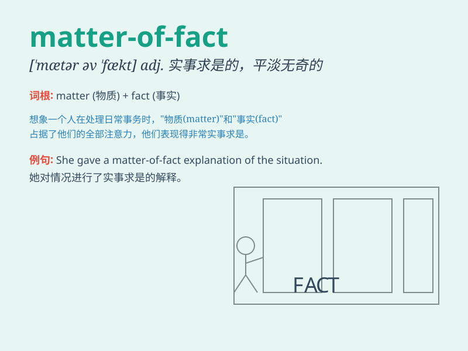

## matter-of-fact

**英音:** _[ˌmætə(r) əv ˈfækt]_ **美音:** _[ˌmætər əv
ˈfækt]_

**译义:** *adj.实事求是的；讲求实际的；就事论事的*

### 短语

+ **matter-of-fact tone:** _实事求是的语气_

+ **matter-of-fact approach:** _实事求是的方法_

+ **matter-of-fact statement:** _实事求是的陈述_

+ **matter-of-fact attitude:** _实事求是的态度_

+ **matter-of-fact description:** _实事求是的描述_

### 例句

#### 例句1

> **His tone was matter-of-fact, without a hint of emotion.**

**中文翻译:** 他的语气很平淡，没有一丝感情。

**单词释义:** 平淡的；实事求是的

#### 例句2

> **She gave a matter-of-fact account of the incident.**

**中文翻译:** 她对事件进行了实事求是的描述。

**单词释义:** 实事求是的

#### 例句3

> **The doctor\'s manner was matter-of-fact as she delivered the
diagnosis.**

**中文翻译:** 医生在给出诊断时态度很平淡。

**单词释义:** 平淡的；冷静客观的

### 背诵小故事

> A detective was investigating a case. When asked about the clues, he
gave a matter-of-fact reply, presenting the facts without any
exaggeration or emotion, just like stating simple truths.

**一位侦探正在调查一个案子。当被问及线索时，他给出了实事求是的回答，不带任何夸张和情绪，就像陈述简单的事实一样。**

### 图义

