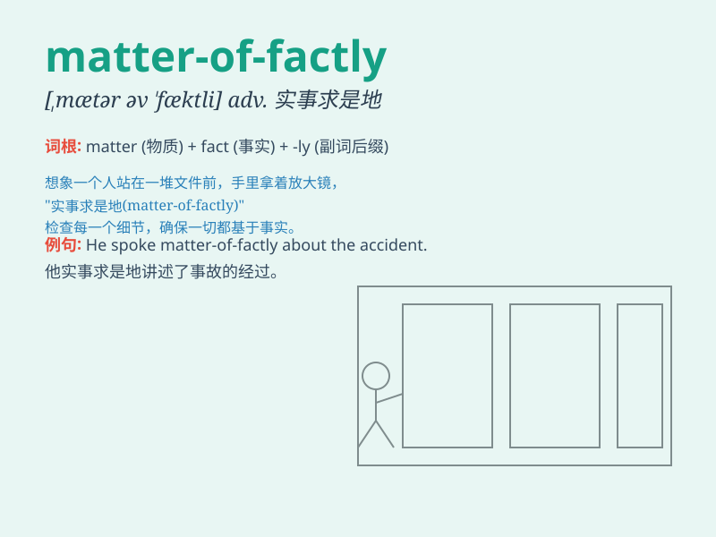

## matter-of-factly

**英音:** _[\'mætərəfæk(t)ʃlɪ]_ **美音:**
_[\'mætərəfæktʃli]_

**译义:**
*副词，表示以一种直接、坦率且不含个人情感或偏见的方式；事实求是地；就事论事地*

### 短语

+ **matter-of-factly speaking:** _实事求是地说_

+ **matter-of-factly attitude:** _实事求是的态度_

+ **matter-of-factly description:** _实事求是的描述_

+ **matter-of-factly account:** _实事求是的叙述_

+ **matter-of-factly statement:** _实事求是的陈述_

### 例句

#### 例句1

> **He spoke matter-of-factly about the difficult situation.**

**中文翻译:** 他实事求是地谈论了困难的局面。

**单词释义:** 实事求是地

#### 例句2

> **She answered the question matter-of-factly, without any
hesitation.**

**中文翻译:** 她毫不犹豫地实事求是的回答了这个问题。

**单词释义:** 实事求是地

#### 例句3

> **The doctor explained the diagnosis matter-of-factly to the
patient.**

**中文翻译:** 医生实事求是地向病人解释了诊断结果。

**单词释义:** 实事求是地

### 背诵小故事

> One day, Tom was explaining a complex problem matter-of-factly. He
spoke clearly and directly without any exaggeration. His matter-of-fact
attitude made everyone understand the situation easily.

**有一天，汤姆实事求是地解释一个复杂的问题。他清晰直接地讲述，没有任何夸张。他实事求是的态度让每个人都轻松地理解了情况。**

### 图义

