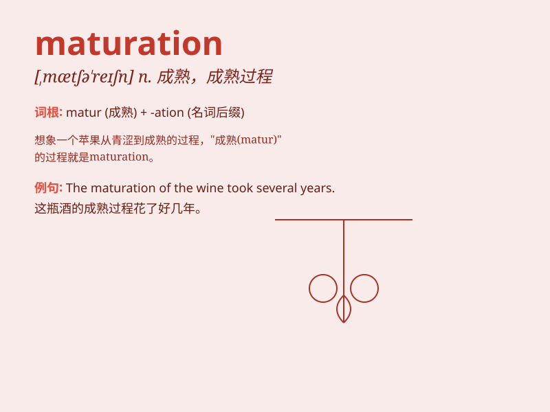

## maturation

**英音:** _[mætjʊ\'reɪʃ(ə)n]_ **美音:**
_[,mætʃu\'reʃən]_

**译义:** *n.化脓,成熟*

### 短语

+ **cell maturation:** _细胞成熟_

+ **maturation process:** _成熟过程_

+ **sexual maturation:** _性成熟_

+ **fruit maturation:** _果实成熟_

+ **maturation stage:** _成熟阶段_

### 例句

#### 例句1

> **The maturation of the fruit takes several weeks.**

**中文翻译:** 水果的成熟需要几个星期。

**单词释义:** 成熟

#### 例句2

> **The process of maturation is often accompanied by changes in
appearance and texture.**

**中文翻译:** 成熟的过程通常伴随着外观和质地的变化。

**单词释义:** 成熟；发育成熟

#### 例句3

> **The maturation of a person\'s character occurs over time.**

**中文翻译:** 一个人的性格成熟是随着时间发生的。

**单词释义:** 成熟；发展

### 背诵小故事

> A little seed was buried in the soil. It went through many days and
nights, absorbing sunlight and rain. Finally, it completed its
maturation and grew into a big, strong tree, ready to face the world.

**一颗小种子被埋在土里。它经历了许多个日夜，吸收着阳光和雨水。最终，它完成了成熟，长成了一棵高大、强壮的树，准备好面对这个世界。**

### 图义

