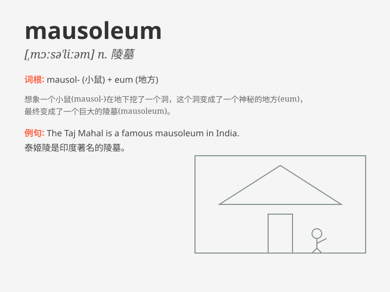

## mausoleum

**英音:** _[ˌmɔːsəˈliːəm]_ **美音:** _[ˌmɔːsəˈliːəm]_

**译义:** *n.陵墓*

### 短语

+ **imperial mausoleum:** _帝王陵墓_

+ **ancient mausoleum:** _古代陵墓_

+ **royal mausoleum:** _皇家陵墓_

+ **grand mausoleum:** _宏伟的陵墓_

+ **magnificent mausoleum:** _壮丽的陵墓_

### 例句

#### 例句1

> **The king\'s mausoleum was a magnificent structure.**

**中文翻译:** 国王的陵墓是一座宏伟的建筑。

**单词释义:** 陵墓

#### 例句2

> **They visited the ancient mausoleum to pay their respects.**

**中文翻译:** 他们参观了这座古老的陵墓以表示敬意。

**单词释义:** 陵墓

#### 例句3

> **The mausoleum was surrounded by beautiful gardens.**

**中文翻译:** 这座陵墓被美丽的花园环绕着。

**单词释义:** 陵墓

### 背诵小故事

> A king was very worried about his final resting place. So, he built a
grand MAUSOLEUM. It was a huge and beautiful building, filled with
precious treasures, to ensure his eternal peace.

**一位国王非常担心他的安息之地。于是，他建造了一座宏伟的陵墓。这是一座巨大而美丽的建筑，里面装满了珍贵的宝藏，以确保他永远安息。**

### 图义

