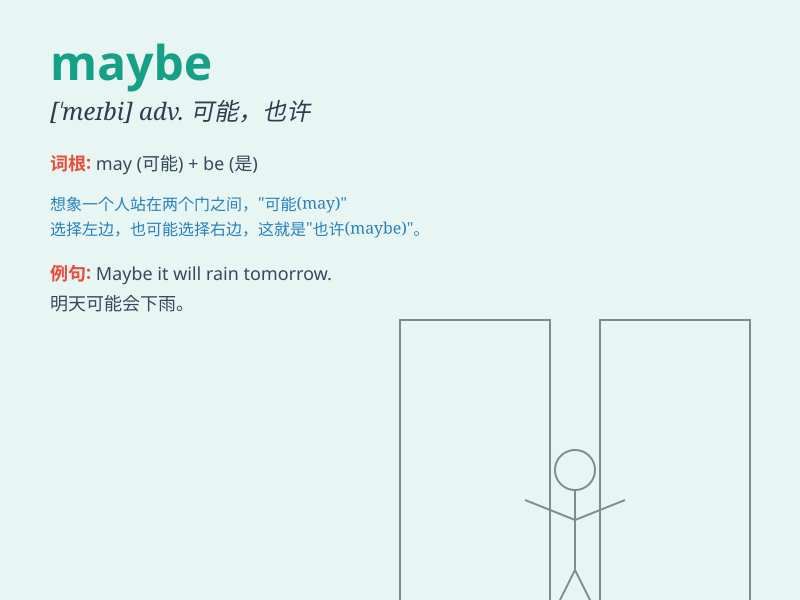

## maybe

**英音:** _[\'meɪbiː; -bɪ]_ **美音:** _[\'mebi]_

**译义:** *adv.大概,或许n.疑虑*

### 短语

+ **maybe not:** _也许不_

+ **maybe so:** _也许是这样_

+ **maybe later:** _也许稍后_

+ **maybe tomorrow:** _也许明天_

+ **maybe yes:** _也许是_

### 例句

#### 例句1

> **Maybe she\'ll come tomorrow.**

**中文翻译:** 也许她明天会来。

**单词释义:** 也许；大概；可能

#### 例句2

> **Maybe you are right.**

**中文翻译:** 也许你是对的。

**单词释义:** 也许；大概；可能

#### 例句3

> **I\'m not sure. Maybe it will rain.**

**中文翻译:** 我不知道。也许会下雨。

**单词释义:** 也许；大概；可能

### 背诵小故事

> One day, Tom was lost in thought. His friend asked if he would go to
the party. Tom said, \'Maybe. I\'m not sure yet.\' It means there\'s a
possibility but not a definite answer.

**有一天，汤姆陷入沉思。他的朋友问他是否会去参加派对。汤姆说："也许吧。我还不确定。"这意味着有可能性但不是确定的回答。**

### 图义

