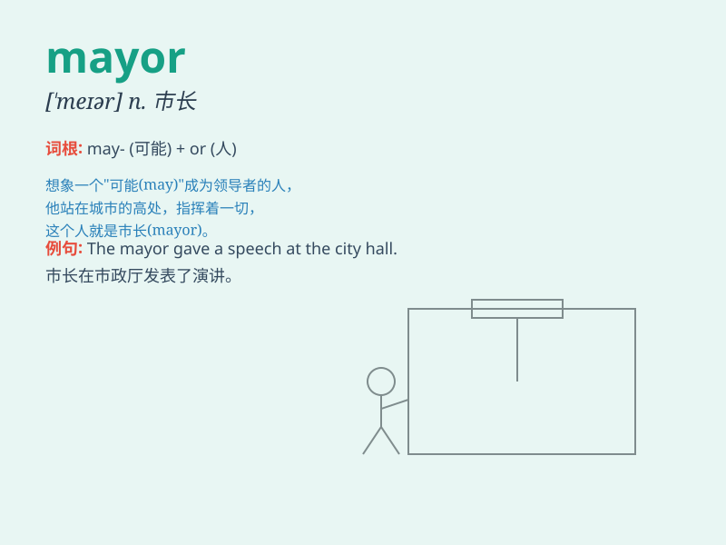

## mayor

**英音:** _[ˈmeɪə]_ **美音:** _[\'meɚ]_

**译义:** *n.市长*

### 短语

+ **town mayor:** _镇市长_

+ **city mayor:** _城市市长_

+ **mayor of London:** _伦敦市长_

+ **elected mayor:** _当选市长_

+ **incumbent mayor:** _现任市长_

### 例句

#### 例句1

> **The mayor of the city attended the opening ceremony.**

**中文翻译:** 该市市长出席了开幕式。

**单词释义:** 市长

#### 例句2

> **She hopes to become the mayor in the next election.**

**中文翻译:** 她希望在下次选举中成为市长。

**单词释义:** 市长

#### 例句3

> **The mayor made a speech about the city\'s development plans.**

**中文翻译:** 市长就该市的发展计划发表讲话。

**单词释义:** 市长

### 背诵小故事

> In a small town, there was a big election. Everyone was waiting to
see who would become the leader. Finally, Tom was chosen as the mayor.
He promised to make the town better and everyone trusted him.

**在一个小镇上，有一场大型选举。每个人都在等着看谁会成为领导者。最后，汤姆被选为了市长。他承诺让这个小镇变得更好，每个人都信任他。**

### 图义

