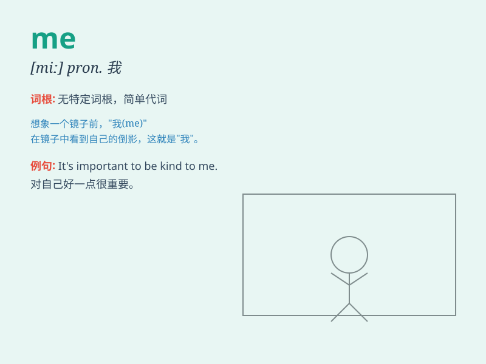

## me

**英音:** _[miː]_ **美音:** _[mi]_

**译义:** * pron.我*

### 短语

+ **me too:** _我也是_

+ **excuse me:** _对不起；打扰一下_

+ **follow me:** _跟我来_

+ **between you and me:** _咱俩私下说说；不对外人讲_

+ **leave me alone:** _别管我；别打扰我_

### 例句

#### 例句1

> **He gave the book to me.**

**中文翻译:** 他把书给了我。

**单词释义:** 我（宾格）

#### 例句2

> **It\'s all about me.**

**中文翻译:** 都是关于我的。

**单词释义:** 我（宾格）

#### 例句3

> **You and me should work together.**

**中文翻译:** 你和我应该一起努力。

**单词释义:** 我（宾格）

### 背诵小故事

>
想象一下，你走进一个神秘的房间，里面只有一面镜子。当你看向镜子时，镜子里出现的那个人就是\'me\'，也就是你自己。你对着镜子微笑，\'me\'也微笑回应，因为\'me\'代表的就是你呀！

**想象你走进一个房间，镜子里出现的自己就是\'me\'，代表你自己。你微笑，\'me\'也微笑，因为\'me\'就是你。**

### 图义

