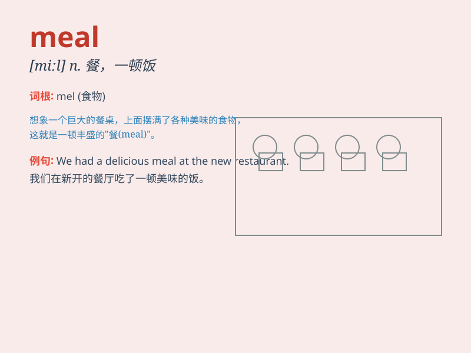

## meal

**英音:** _[miːl]_ **美音:** _[mil]_

**译义:** *n.一餐,一顿饭,膳食,(谷类的)粗粉vi.进餐*

### 短语

+ **square meal:** _丰盛的一餐_

+ **light meal:** _清淡的一餐_

+ **meal ticket:** _饭票；提供生活来源的人或事物_

+ **cook a meal:** _做饭_

+ **have a meal:** _吃饭_

### 例句

#### 例句1

> **I had a delicious meal at the new restaurant.**

**中文翻译:** 我在新开的餐厅吃了一顿美味的饭。

**单词释义:** 饭；一餐

#### 例句2

> **The meal included soup, salad, and dessert.**

**中文翻译:** 这顿饭包括汤、沙拉和甜点。

**单词释义:** 一餐；膳食

#### 例句3

> **We need to prepare the meal for the guests.**

**中文翻译:** 我们需要为客人准备饭菜。

**单词释义:** 饭菜；饮食

### 背诵小故事

> One day, a hungry traveler was looking for a meal. He walked and
walked until he found a small restaurant. He sat down and enjoyed a
delicious meal of steak and salad. After the meal, he felt full and
happy.

**有一天，一位饥饿的旅行者正在寻找一顿饭。他走啊走，直到找到一家小餐馆。他坐下来，享用了一顿美味的牛排和沙拉。吃完这顿饭，他感到饱足和开心。**

### 图义

