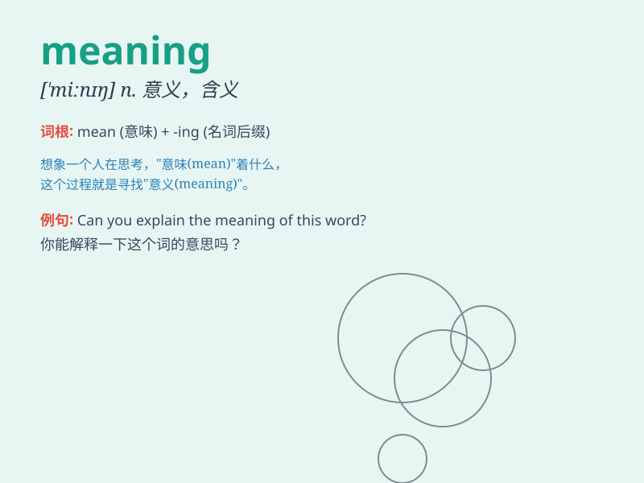

## meaning

**英音:** _[\'miːnɪŋ]_ **美音:** _[\'minɪŋ]_

**译义:** *n.意义,含意,意图,[逻]内涵adj.意味深长的*

### 短语

+ **the meaning of:** _\...\...的意思_

+ **give meaning to:** _赋予\...\...意义_

+ **convey meaning:** _传达意思_

+ **lose meaning:** _失去意义_

+ **find meaning in:** _在\...\...中找到意义_

### 例句

#### 例句1

> **The meaning of this word is quite clear.**

**中文翻译:** 这个单词的意思相当清晰。

**单词释义:** 意思；意义

#### 例句2

> **What is the meaning of life?**

**中文翻译:** 生命的意义是什么？

**单词释义:** 意义

#### 例句3

> **I couldn\'t figure out the meaning of his gesture.**

**中文翻译:** 我弄不明白他手势的意思。

**单词释义:** 意思

### 背诵小故事

> One day, a little boy was lost in a forest. He was very scared and
didn\'t know the meaning of the strange signs. But finally, a kind guide
came and explained the meaning, helping the boy find his way home.

**有一天，一个小男孩在森林里迷路了。他非常害怕，不明白那些奇怪标志的意思。但最后，一位善良的向导来了，解释了意思，帮助男孩找到了回家的路。**

### 图义

