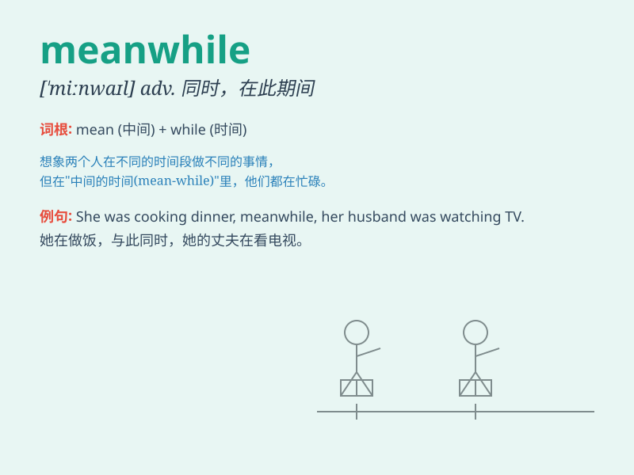

## meanwhile

**英音:** _[\'miːnwaɪl]_ **美音:** _[\'minwaɪl]_

**译义:** * (=meantime)n.其间,其时;adv.其间*

### 短语

+ **in the meanwhile:** _在此期间；与此同时_

+ **meanwhile back:** _（用于故事中）与此同时_

+ **meanwhile at:** _同时在（某个地方）_

+ **meanwhile with:** _同时与（某人或某物）_

+ **meanwhile from:** _同时来自_

### 例句

#### 例句1

> **I was doing my homework. Meanwhile, my sister was watching
TV.**

**中文翻译:** 我在做作业。与此同时，我妹妹在看电视。

**单词释义:** 与此同时

#### 例句2

> **The doctor was busy saving the patient. Meanwhile, the family
members were waiting anxiously outside.**

**中文翻译:**
医生正忙着抢救病人。与此同时，家属们在外面焦急地等待着。

**单词释义:** 与此同时

#### 例句3

> **She was cooking in the kitchen. Meanwhile, he was cleaning the
living room.**

**中文翻译:** 她在厨房做饭。与此同时，他在打扫客厅。

**单词释义:** 与此同时

### 背诵小故事

> A man was climbing a mountain. Meanwhile, his friend was having a
picnic at the foot of the mountain. They were doing different things at
the same time.

**一个男人正在爬山。与此同时，他的朋友正在山脚下野餐。他们在同一时间做着不同的事。**

### 图义

