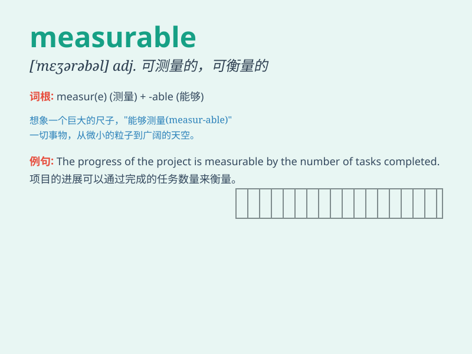

## measurable

**英音:** _[\'meʒ(ə)rəb(ə)l]_ **美音:** _[\'mɛʒərəbl]_

**译义:** *adj.可测量的*

### 短语

+ **measurable improvement:** _可衡量的改进_

+ **measurable outcome:** _可衡量的结果_

+ **measurable benefit:** _可衡量的利益_

+ **measurable progress:** _可衡量的进展_

+ **measurable effect:** _可衡量的效果_

### 例句

#### 例句1

> **The progress made in this project is measurable.**

**中文翻译:** 这个项目取得的进展是可衡量的。

**单词释义:** 可衡量的

#### 例句2

> **There is a measurable improvement in her writing skills.**

**中文翻译:** 她的写作技巧有了显著的提高。

**单词释义:** 显著的；可测量的

#### 例句3

> **The impact of this policy on the economy is not yet
measurable.**

**中文翻译:** 这项政策对经济的影响还无法衡量。

**单词释义:** 可衡量的；可测量的

### 背诵小故事

> A scientist was conducting an experiment. The results had to be
measurable. He used precise tools to get clear data. Finally, he
achieved measurable success and proved his theory.

**一位科学家正在进行一项实验。实验结果必须是可测量的。他使用了精确的工具来获取清晰的数据。最终，他取得了可衡量的成功并证明了他的理论。**

### 图义

