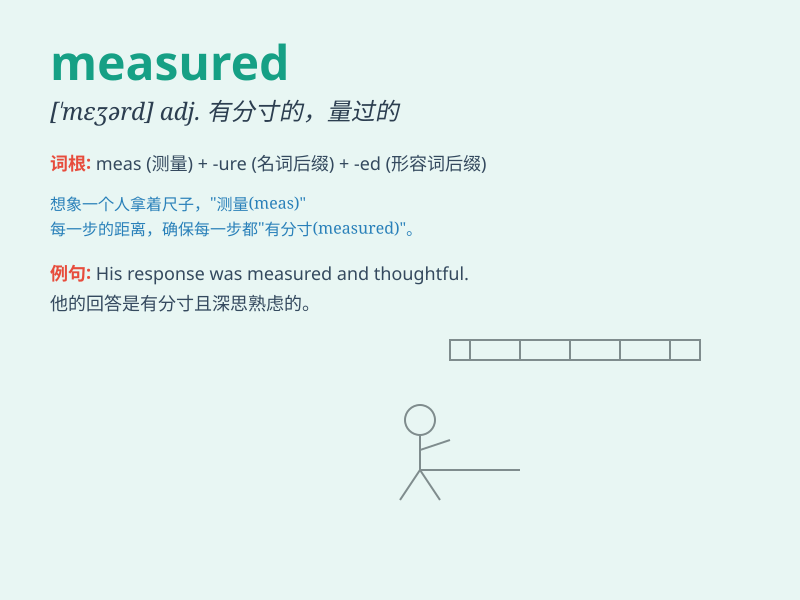

## measured

**英音:** _[\'meʒəd]_ **美音:** _[\'mɛʒɚd]_

**译义:** *adj.标准的,整齐的,有规则的*

### 短语

+ **measured pace:** _有节奏的步伐_

+ **measured response:** _慎重的回应_

+ **measured speech:** _慎重的讲话_

+ **measured tone:** _沉稳的语气_

+ **measured approach:** _慎重的方法_

### 例句

#### 例句1

> **The doctor measured my blood pressure.**

**中文翻译:** 医生测量了我的血压。

**单词释义:** 测量

#### 例句2

> **She spoke in a measured tone.**

**中文翻译:** 她说话语气沉稳。

**单词释义:** 慎重的；有分寸的

#### 例句3

> **The steps were taken in a measured way to avoid mistakes.**

**中文翻译:** 这些步骤是以谨慎的方式采取的，以避免错误。

**单词释义:** 慎重的；深思熟虑的

### 背诵小故事

> A king wanted to build a new palace. The architect carefully measured
the land. Every step and every distance was measured precisely. Finally,
a perfect palace was built.

**一位国王想要建造一座新宫殿。建筑师仔细地测量土地。每一步和每段距离都被精确测量。最终，一座完美的宫殿建成了。**

### 图义

