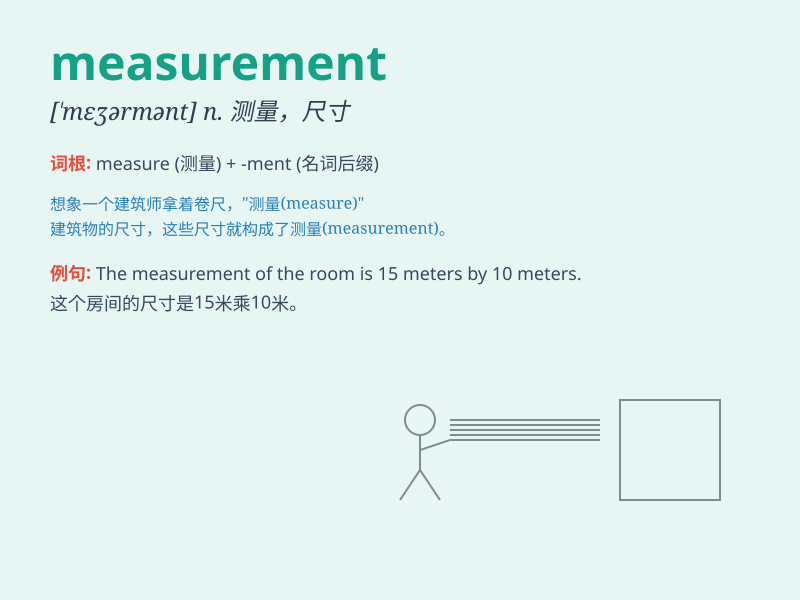

## measurement

**英音:** _[\'meʒəm(ə)nt]_ **美音:** _[\'mɛʒɚmənt]_

**译义:** *n.测量法,度量,(量得的)尺寸,度量单位制*

### 短语

+ **measurement error:** _测量误差_

+ **measurement system:** _测量系统_

+ **accurate measurement:** _精确测量_

+ **measurement unit:** _测量单位_

+ **precision measurement:** _精密测量_

### 例句

#### 例句1

> **The measurement of the room is 5 meters by 4 meters.**

**中文翻译:** 这个房间的尺寸是 5 米乘 4 米。

**单词释义:** 尺寸；度量

#### 例句2

> **Accurate measurement is crucial in scientific experiments.**

**中文翻译:** 在科学实验中，精确的测量至关重要。

**单词释义:** 测量；测定

#### 例句3

> **We need to take the measurement of your waist for the new
dress.**

**中文翻译:** 我们需要为新裙子量一下你的腰围。

**单词释义:** 量度；测量数据

### 背诵小故事

> A scientist was doing an experiment and needed accurate measurement.
He used various tools, carefully noting down the numbers. Finally, he
got the perfect measurement and made a great discovery!

**一位科学家正在做实验，需要精确的测量。他使用了各种工具，仔细地记下数字。最后，他得到了完美的测量结果，并取得了重大发现！**

### 图义

